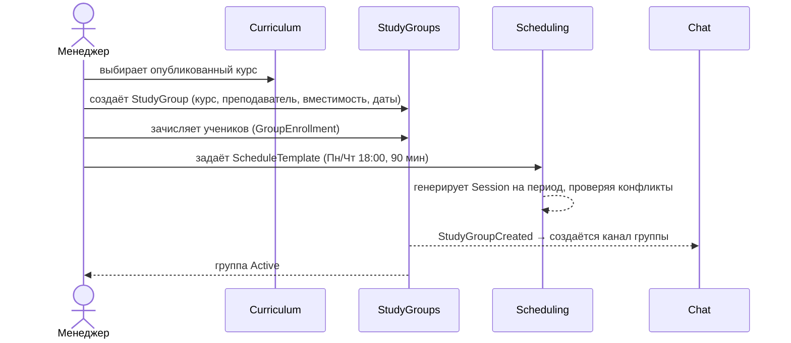
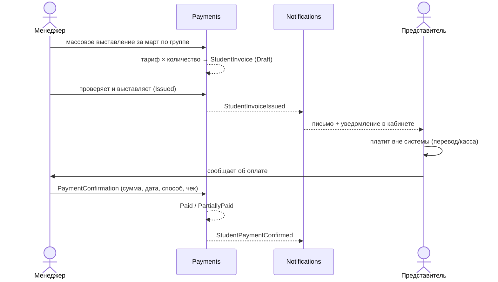

# Роли и сценарии

← [[Edvantix]]

## Роли

Роли — не enum в коде, а записи `FshRole` с набором прав ([[Модель прав доступа]]).
Ниже — предустановленные роли из сида; школа создаёт свои.

| Роль | Область | Кто это |
|---|---|---|
| `SuperAdmin` | Платформа (root-тенант) | Оператор Edvantix. Тенанты, планы, кросс-тенантный аудит |
| `SchoolAdmin` | Тенант | Владелец/директор школы. Всё внутри своей школы, включая роли и настройки |
| `Manager` | Тенант | Администратор школы. Ученики, группы, расписание, счета. Не трогает роли |
| `Teacher` | Тенант | Своё расписание, свои группы, посещаемость, материалы уроков |
| `Student` | Тенант | Своё расписание, свои материалы, свои счета |
| `Guardian` | Тенант | То же по подопечным ученикам + счета к оплате |

> [!note] Менеджер — это роль, а не сущность
> Ученик/преподаватель/представитель — записи в [[People]] (могут существовать без логина).
> Менеджер — всегда пользователь `FshUser` с ролью. Отдельной сущности `Manager` нет.
> Обоснование — [[ADR-003 People как отдельный модуль]].

## Сценарии

### С1. Запуск новой группы (Manager)

### С2. Проведение занятия (Teacher)

1. Преподаватель видит занятие в своём расписании.
2. Открывает — видит привязанный урок программы и его материалы.
3. Отмечает посещаемость: `Present` / `Absent` / `Late` / `Excused`.
4. Переводит занятие в `Held`. Событие `SessionHeld` → [[Auditing]], [[Webhooks]].
5. Пропуск без уважительной причины → [[Notifications]] представителю.

### С3. Отмена и перенос занятия (Manager / Teacher)

- **Отмена** — `Session.Status = Cancelled` + причина. Ученики и представители уведомляются.
- **Перенос** — исходное занятие `Rescheduled`, создаётся новое со ссылкой `RescheduledFromId`.
  История переносов сохраняется — важно для разбора претензий.
- Влияние на деньги зависит от тарифа: помесячный — нет, за занятие — списание не происходит.

### С4. Выставление счёта (Manager)

Ключевое: **система не принимает деньги**. Она фиксирует обязательство и факт его закрытия
человеком. Каждое подтверждение записывается в [[Auditing]] с автором и временем.

### С5. Заявка → ученик (Manager)

Заявка заводится как `Student` со статусом `Lead`. После пробного занятия и оплаты —
`Active` и зачисление в группу. Отдельного модуля CRM в MVP нет.

### С6. Кабинет представителя (Guardian)

Видит: расписание подопечных, посещаемость, счета и задолженность, материалы уроков.
Не видит: других учеников группы, внутренние заметки менеджеров, финансы школы.

### С7. Разбор инцидента (SchoolAdmin)

«Кто удалил ученика из группы 3 марта?» → [[Auditing]]: запись с пользователем, временем,
до/после. Аудит пишется автоматически перехватчиком EF, обходных путей нет.

## Матрица доступа (сводно)

| Действие | SuperAdmin | SchoolAdmin | Manager | Teacher | Student | Guardian |
|---|:-:|:-:|:-:|:-:|:-:|:-:|
| Управление тенантами | ✅ | — | — | — | — | — |
| Роли и права школы | ✅ | ✅ | — | — | — | — |
| Курсы и уроки | ✅ | ✅ | ✅ | 👁 | 👁 своих | 👁 подопечных |
| Учебные группы | ✅ | ✅ | ✅ | 👁 своих | 👁 своих | 👁 подопечных |
| Расписание (правка) | ✅ | ✅ | ✅ | 🔸 своих | — | — |
| Посещаемость | ✅ | ✅ | ✅ | ✅ своих | 👁 своей | 👁 подопечных |
| Счета (выставление) | ✅ | ✅ | ✅ | — | — | — |
| Подтверждение оплаты | ✅ | ✅ | ✅ | — | — | — |
| Просмотр счетов | ✅ | ✅ | ✅ | — | 👁 своих | 👁 подопечных |
| Аудит | ✅ все тенанты | ✅ свой | 🔸 частично | — | — | — |
| Вебхуки | ✅ | ✅ | — | — | — | — |

✅ полный доступ · 👁 только чтение · 🔸 ограниченно · — нет доступа

Точные имена прав — [[Модель прав доступа]].

## Связанное

[[Глоссарий]] · [[Продуктовое видение]] · [[Модель прав доступа]]
