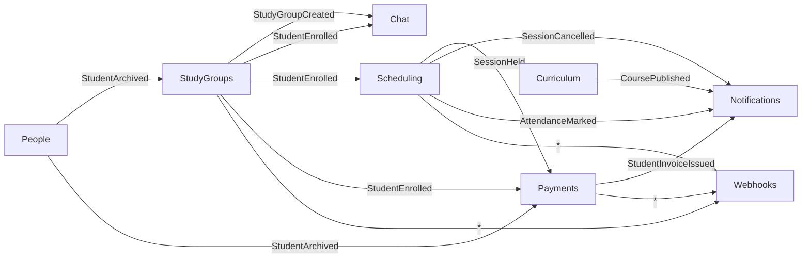

# Интеграционные события

← [[Edvantix]] · [[Обзор архитектуры]]

Модули общаются событиями. Транспорт — Outbox/Inbox поверх PostgreSQL
(`BuildingBlocks/Eventing`). Правила — `.agents/rules/eventing.md`.

## Два уровня

| | Доменное событие | Интеграционное событие |
|---|---|---|
| Область | внутри модуля | между модулями |
| Транзакция | та же | отдельная, через Outbox |
| Доставка | синхронно | асинхронно, минимум один раз |
| Где объявлено | `Domain/Events/` | `Contracts/IntegrationEvents/` |

> [!warning] Доставка «минимум один раз»
> Обработчик обязан быть идемпотентным. Повторная доставка `StudentPaymentConfirmed`
> не должна создать вторую отметку об оплате. Inbox дедуплицирует по `EventId` —
> используйте его, а не самодельные проверки.

## Каталог событий Edvantix

### People

| Событие | Кто слушает | Зачем |
|---|---|---|
| `StudentCreated` | Webhooks, Auditing | внешняя CRM |
| `StudentStatusChanged` | StudyGroups, Payments | архивация → отчисление, остановка начислений |
| `StudentArchived` | StudyGroups, Scheduling, Payments | завершить зачисления, снять с будущих занятий |
| `TeacherDeactivated` | StudyGroups, Scheduling | предупредить о группах и занятиях без преподавателя |
| `GuardianLinkedToStudent` | Notifications | доступ к кабинету подопечного |

### Curriculum

| Событие | Кто слушает | Зачем |
|---|---|---|
| `CoursePublished` | Notifications, Webhooks | курс доступен для набора групп |
| `CourseArchived` | StudyGroups | запретить создание новых групп по курсу |
| `LessonMaterialAdded` | Notifications | уведомить учеников групп, проходящих урок |

### StudyGroups

| Событие | Кто слушает | Зачем |
|---|---|---|
| `StudyGroupCreated` | Chat | создать канал группы |
| `StudyGroupActivated` | Scheduling | разрешить генерацию занятий |
| `StudentEnrolled` | Chat, Scheduling, Payments, Notifications | добавить в канал, в будущие занятия, начать тарификацию |
| `StudentUnenrolled` | Chat, Scheduling, Payments | убрать из канала и будущих занятий, остановить начисления |
| `StudyGroupFinished` | Payments, Notifications | закрыть период, финальный счёт |

### Scheduling

| Событие | Кто слушает | Зачем |
|---|---|---|
| `SessionScheduled` | Notifications | напоминание за сутки |
| `SessionCancelled` | Notifications, Payments, Webhooks | уведомить всех; при потарифной оплате не начислять |
| `SessionRescheduled` | Notifications, Chat | уведомить об изменении времени |
| `SessionHeld` | Payments | основание для начисления «за занятие» |
| `AttendanceMarked` | Notifications | пропуск → уведомление представителю |

### Payments

| Событие | Кто слушает | Зачем |
|---|---|---|
| `StudentInvoiceIssued` | Notifications, Webhooks | письмо плательщику, интеграция с бухгалтерией |
| `StudentPaymentConfirmed` | Notifications, StudyGroups, Webhooks | подтверждение, снятие блокировки доступа |
| `StudentInvoiceOverdue` | Notifications | напоминание о задолженности |
| `StudentInvoiceCancelled` | Webhooks, Auditing | сторнирование |

## Схема потоков

## Соглашения

**Именование** — прошедшее время, суффикс `IntegrationEvent`:
`StudentEnrolledIntegrationEvent`.

**Содержимое** — идентификаторы и минимум данных для реакции. Не тащить весь агрегат:
получатель запросит через Contracts, если нужно больше. Исключение — данные, нужные
для «снимка» истории (сумма счёта на момент выставления).

**Версионирование** — событие в `Contracts` = публичный контракт. Ломающее изменение —
новый тип `V2`, старый живёт до миграции всех подписчиков.

**Порядок не гарантирован.** Обработчик `StudentUnenrolled` может прийти раньше
`StudentEnrolled` при ретраях. Проверяйте текущее состояние, а не полагайтесь на
последовательность.

## Вебхуки

[[Webhooks]] подписывается на события и ретранслирует наружу. Новые типы событий надо
добавить в каталог доступных школе подписок. Тело — стабильный публичный контракт,
не переиспользовать внутренние DTO.

## Связанное

[[Карта модулей]] · [[Webhooks]] · `.agents/skills/add-integration-event/SKILL.md`
