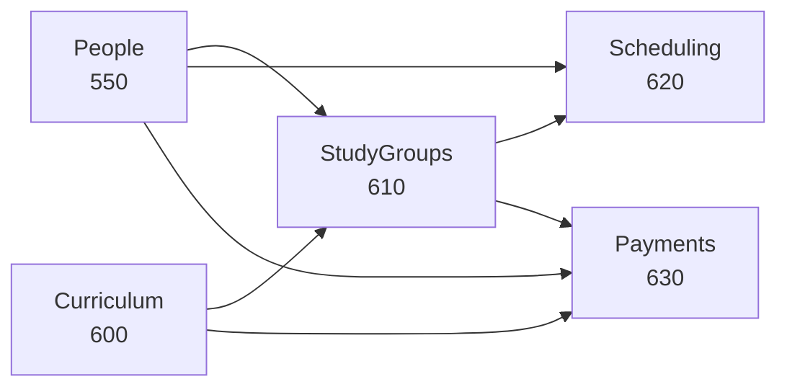

# Карта модулей

← [[Edvantix]] · [[Обзор архитектуры]]

## Полный реестр

Порядок — значение в `[assembly: FshModule(typeof(XModule), order)]`. Определяет очередь
инициализации (миграции, сиды, регистрация прав). Модуль не должен зависеть при старте
от модуля с бо́льшим порядком.

| Порядок | Модуль              | Статус     | Назначение                                        |
| ------: | ------------------- | ---------- | ------------------------------------------------- |
|     100 | [[Identity]]        | ✅ есть     | Пользователи, роли, права, сессии, имперсонация   |
|     200 | [[Multitenancy]]    | ✅ есть     | Школы-тенанты, темы, сроки действия               |
|     300 | [[Auditing]]        | ✅ есть     | Журнал изменений                                  |
|     350 | [[Files]]           | ✅ есть     | Файлы, presigned-загрузки, S3/MinIO               |
|     400 | [[Webhooks]]        | ✅ есть     | Подписки и доставка исходящих вебхуков            |
|     500 | [[Billing]]         | ✅ есть     | SaaS-подписки школ (деньги Edvantix)              |
|     550 | [[People]]          | ✅ есть     | Ученики, преподаватели, представители             |
| ~~600~~ | ~~Catalog~~         | ✅ удалён (backend, 2026-08-27) | Демо-витрина e-commerce → [[Catalog (удаляется)]] |
|     600 | [[Curriculum]]      | ✅ есть     | Курсы, разделы, уроки, материалы                  |
|     610 | [[StudyGroups]]     | ✅ есть     | Учебные группы, зачисления                        |
|     620 | [[Scheduling]]      | ✅ есть     | Шаблоны, занятия, посещаемость, аудитории         |
|     630 | [[Payments]]        | ✅ есть     | Тарифы, счета ученикам, подтверждение оплат       |
|     700 | [[Tickets]]         | ✅ есть     | Обращения в поддержку                             |
|     750 | [[Notifications]]   | ✅ есть     | Уведомления в приложении                          |
|     800 | [[Chat]]            | ✅ есть     | Каналы, сообщения, вложения, реакции              |

`Curriculum` занимает освободившийся слот `600` — Catalog удалён целиком (backend, оставлен
frontend — [[Задачи · Удаление Catalog]]; см. [[ADR-002 Catalog заменяется на Curriculum]]).

## Почему такой порядок у новых модулей

- `People` первым: на учеников и преподавателей ссылаются все остальные.
- `Curriculum` до `StudyGroups`: группа создаётся под существующий курс.
- `Scheduling` после `StudyGroups`: занятие принадлежит группе.
- `Payments` последним: тарифицирует зачисления и посещения.

## Матрица зависимостей

Строка ссылается на `.Contracts` столбца. `Architecture.Tests` заваливает сборку при попытке
сослаться на runtime-проект.

| ↓ зависит от → | Identity | Multitenancy | Files | People | Curriculum | StudyGroups | Scheduling | Payments |
|---|:-:|:-:|:-:|:-:|:-:|:-:|:-:|:-:|
| **People** | ✔ | ✔ | ✔ | — | | | | |
| **Curriculum** | ✔ | ✔ | ✔ | | — | | | |
| **StudyGroups** | ✔ | ✔ | | ✔ | ✔ | — | | |
| **Scheduling** | ✔ | ✔ | | ✔ | ✔ | ✔ | — | |
| **Payments** | ✔ | ✔ | ✔ | ✔ | ✔ | ✔ | ✔ | — |
| **Chat** | ✔ | ✔ | ✔ | | | ◇ | | |
| **Notifications** | ✔ | ✔ | | ◇ | | ◇ | ◇ | ◇ |
| **Webhooks** | ✔ | ✔ | | ◇ | ◇ | ◇ | ◇ | ◇ |
| **Auditing** | ✔ | ✔ | | | | | | |

✔ прямая ссылка на Contracts · ◇ только подписка на интеграционные события (без ссылки на сборку)

> [!tip] Предпочитайте ◇ вместо ✔
> Реакция на событие вместо прямого вызова снижает связанность. `Notifications` не должен
> знать про `Scheduling` — он обрабатывает `SessionCancelledIntegrationEvent`.
> Прямая ссылка нужна, только когда требуется синхронный ответ (например, `Payments`
> запрашивает у `Scheduling` количество проведённых занятий за период через
> `IAttendanceQueryService`/`ISessionPlanQueryService`).

## Что переиспользуем как есть

| Модуль | Как применяется в Edvantix |
|---|---|
| [[Identity]] | Требование «гибкая ролевая система» закрыто полностью: роли, права по ресурсу/действию, группы доступа, имперсонация, история паролей |
| [[Auditing]] | Требование «подробный аудит» закрыто: перехватчик EF пишет до/после автоматически |
| [[Webhooks]] | Требование «вебхуки» закрыто: подписки, доставка, ретраи, журнал. Нужно только добавить новые типы событий |
| [[Chat]] | Требование «чат» закрыто: каналы, DM, вложения, упоминания, реакции. Добавляем автосоздание канала на учебную группу |
| [[Tickets]] | Требование «тикеты» закрыто |
| [[Notifications]] | Основа для напоминаний о занятиях и счетах |
| [[Files]] | Материалы уроков, аватары, чеки об оплате |
| [[Multitenancy]] | Изоляция школ |
| [[Billing]] | Монетизация самой платформы |

Восемь из одиннадцати пунктов требований закрыты каркасом. Писать нужно предметную часть:
группы, расписание, оплаты учеников, люди, программа.

## Связанное

[[Регистрация модуля]] · [[Интеграционные события]] · [[Бэклог]]
