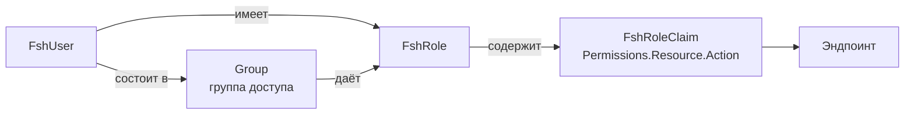

# Модель прав доступа

← [[Edvantix]] · [[Роли и сценарии]]

Требование «гибкая ролевая система» закрывается существующим [[Identity]] без доработок ядра —
нужно лишь зарегистрировать права новых модулей.

## Устройство



Право — строка `Permissions.{Resource}.{Action}`, собираемая из записи
`FshPermission(Description, Action, Resource, IsBasic, IsRoot)`
(`BuildingBlocks/Shared/Identity/PermissionConstants.cs`).

Реестр не имеет встроенных значений: каждый модуль в своём `ConfigureServices` вызывает
`PermissionConstants.Register(...)`. Права попадают в роли через `RolePermissionSyncer`
(hosted service) и кэшируются в `PermissionSet`.

Флаги:

- `IsBasic: true` — попадает в базовую роль любого аутентифицированного пользователя;
- `IsRoot: true` — только root-тенант (`SuperAdmin`), см. [[Мультитенантность]].

## Права новых модулей

### People

| Ресурс | Действия |
|---|---|
| `Students` | `View` `Create` `Update` `Delete` `Export` `ViewNotes` |
| `Teachers` | `View` `Create` `Update` `Delete` |
| `Guardians` | `View` `Create` `Update` `Delete` |

`Students.ViewNotes` отделено намеренно: внутренние заметки менеджеров о ученике не должны
быть видны преподавателю.

### Curriculum

| Ресурс | Действия |
|---|---|
| `Subjects` | `View` `Create` `Update` `Delete` |
| `Courses` | `View` `Create` `Update` `Delete` `Publish` `Restore` `ViewTrash` |
| `Lessons` | `View` `Create` `Update` `Delete` |
| `LessonMaterials` | `View` `Manage` |

`Courses.Publish` отдельно: черновик курса правит методист, публикацию утверждает
администратор (`ArchiveCourse` гейтится тем же правом — обе операции меняют статус курса).
Разделы курса (`CourseModule`) отдельного ресурса не имеют — их CRUD и перестановка
гейтятся `Courses.Update`.

### StudyGroups

| Ресурс | Действия |
|---|---|
| `StudyGroups` | `View` `ViewOwn` `Create` `Update` `Delete` `Archive` |
| `Enrollments` | `View` `Create` `Update` `Delete` `Transfer` |

`ViewOwn` — преподаватель видит только свои группы, ученик только те, где состоит.
Проверка «своих» — в обработчике, право лишь пускает на эндпоинт.

`Enrollments.Update` — смена тарифа/скидки действующего зачисления
(`PUT /enrollments/{id}/tariff`, EDX-007). Отдельно от `Create`, как и `Transfer`:
операция затрагивает деньги. Пауза/возобновление правом `Create` покрываются.

### Scheduling

| Ресурс | Действия |
|---|---|
| `Sessions` | `View` `ViewOwn` `Create` `Update` `Cancel` `Reschedule` `Generate` |
| `Attendance` | `View` `ViewOwn` `Mark` `MarkAny` |
| `Rooms` | `View` `Manage` |
| `ScheduleTemplates` | `View` `Manage` |

`Sessions.Generate` — массовая генерация занятий из шаблона; отделено от `Create`,
потому что затрагивает сотни записей. `Attendance.MarkAny` зарегистрировано, но пока не
проверяется в обработчике — правка посещаемости после закрытия периода должна сверяться с
выставленным счётом, а [[Payments]] ещё не реализован; единственное право на эндпоинте
сейчас — `Attendance.Mark`. Нерабочие дни (`NonWorkingDay`) гейтятся тем же `ScheduleTemplates`
— отдельного ресурса под календарь в реестре нет.

### Payments

| Ресурс | Действия |
|---|---|
| `Tariffs` | `View` `Manage` |
| `StudentInvoices` | `View` `ViewOwn` `Create` `Issue` `Cancel` `Export` |
| `StudentPayments` | `View` `Confirm` `Revoke` |

> [!important] `StudentPayments.Confirm` — самое чувствительное право в системе
> Оно означает «объявить, что деньги получены», без внешней проверки. Выдавать только
> доверенным менеджерам, каждое применение писать в [[Auditing]], а `Revoke` (отмена
> ошибочного подтверждения) держать отдельным правом уровня `SchoolAdmin`.

## Предустановленные роли

Сид при провижининге школы ([[Мультитенантность]]):

| Роль | Набор прав |
|---|---|
| `SchoolAdmin` | все не-root права тенанта |
| `Manager` | People/Curriculum/StudyGroups/Scheduling/Payments — полный; Identity — только просмотр |
| `Teacher` | `*.ViewOwn`, `Attendance.Mark`, `LessonMaterials.View`, `Sessions.View` |
| `Student` | `*.ViewOwn` по своим группам, занятиям, счетам, материалам |
| `Guardian` | как `Student`, но по подопечным + `StudentInvoices.ViewOwn` |

Школа редактирует их и создаёт свои через UI ролей — это и есть «гибкость».

## Применение на эндпоинте

```csharp
endpoint.RequirePermission(SchedulingPermissions.Attendance.Mark);
```

Расширения — `BuildingBlocks/Shared/Identity/Authorization/EndpointExtensions.cs`.
Обработчик: `RequiredPermissionAuthorizationHandler`.

## Проверки «своего» (row-level)

Право пускает на эндпоинт; принадлежность проверяется в обработчике:

```csharp
// Преподаватель отмечает посещаемость только на своём занятии
if (!currentUser.HasPermission(SchedulingPermissions.Attendance.MarkAny)
    && session.TeacherId != currentUser.TeacherId)
{
    throw new ForbiddenException("Занятие ведёт другой преподаватель.");
}
```

> [!note] ✅ Решено — `IPeopleScopeResolver`
> Реализован в `People.Contracts` (`ResolveAsync(userId)` → `PeopleScope` с `StudentId?`/
> `TeacherId?`/`GuardianId?`/`WardStudentIds`), кэшируется в модуле People. [[Scheduling]]
> использует его в `GetMyScheduleQuery` (плюс новый метод `IStudyGroupQueryService.
> GetActiveStudyGroupIdsForStudentAsync` — обратная связь «группы ученика», которой не
> хватало). Пример выше (`Attendance.MarkAny`) — иллюстративный: реального row-level гейта
> «занятие ведёт другой преподаватель» в `MarkAttendanceCommandHandler` нет, `Attendance.Mark`
> — единственная проверка сейчас.

## Связанное

[[Identity]] · [[Роли и сценарии]] · [[Мультитенантность]] · `.agents/skills/add-permission/SKILL.md`
