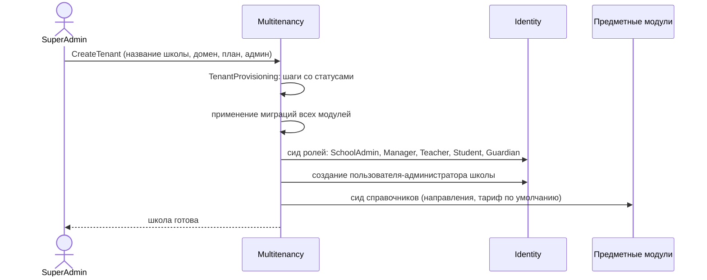

# Мультитенантность

← [[Edvantix]] · [[Обзор архитектуры]]

**Одна школа = один тенант.** Обоснование — [[ADR-001 Школа как тенант]].

## Как работает

Finbuckle 10.x. Тенант определяется по заголовку/поддомену на входе в конвейер, кладётся в
`ITenantInfo`, дальше `BaseDbContext` автоматически:

- проставляет `TenantId` при вставке;
- добавляет глобальный фильтр запросов по `TenantId` при чтении.

**Изоляция включена по умолчанию.** Забыть про неё в новом модуле физически трудно — надо
явно наследоваться от не того контекста.

> [!danger] `base.OnModelCreating` вызывается последним
> ```csharp
> protected override void OnModelCreating(ModelBuilder builder)
> {
>     builder.ApplyConfigurationsFromAssembly(typeof(SchedulingDbContext).Assembly);
>     builder.HasDefaultSchema("scheduling");
>     base.OnModelCreating(builder);   // ← ПОСЛЕДНИМ, иначе фильтры затрутся
> }
> ```

## Что не изолируется

`IGlobalEntity` (`BuildingBlocks/Core/Domain/IGlobalEntity.cs`) — маркер сущности вне тенанта.

В Edvantix глобальными остаются только записи платформы: сами тенанты, планы [[Billing]],
системные справочники. **Ни одна предметная сущность школы глобальной быть не должна** —
ни ученик, ни курс, ни счёт.

> [!warning] Соблазн сделать курсы общими
> Возникнет идея «библиотеки курсов, общей для всех школ». Не в MVP: это ломает изоляцию
> и требует отдельной модели владения контентом. Шаблоны курсов при необходимости решаются
> копированием при создании тенанта, а не общей таблицей.

## Что уже реализовано

| Возможность | Файлы |
|---|---|
| CRUD тенантов | `Features/v1/CreateTenant`, `GetTenants`, `AdjustTenantValidity` |
| Активация/деактивация | `ChangeTenantActivation` |
| Срок действия и продление | `RenewTenant`, `TenantExpiryNotice` |
| Провижининг с шагами и повтором | `TenantProvisioning/*` |
| Брендирование | `TenantTheme`, `GetTenantTheme`, `ResetTenantTheme` |
| Статус для клиента | `GetMyTenantStatus`, страница `tenant-deactivated.tsx` |

Для Edvantix этого достаточно. Правки — только косметические: в UI «Tenant» → «Школа».

## Root-тенант

Тенант `root` — сам оператор Edvantix. Роль `SuperAdmin` в нём получает права с флагом
`IsRoot: true` (`SystemPermissions.Platform.*`): управление тенантами, планами, подписками,
кросс-тенантный аудит, имперсонация. Обычные школы эти права не получают никогда —
`PermissionConstants.Admin` их отфильтровывает.

## Провижининг школы



Точка расширения — `TenantProvisioning` плюс инициализатор в каждом модуле
(`{X}DbInitializer`). Шаги для новых модулей — [[Бэклог]].

## Проверка изоляции

`src/Tests/Integration.Tests` содержит harness на Testcontainers. Для каждой новой сущности —
тест «данные тенанта A невидимы под тенантом B». Правила — `.agents/rules/integration-testing.md`.

## Связанное

[[ADR-001 Школа как тенант]] · [[Multitenancy]] · [[Billing]] · [[Модель прав доступа]]
