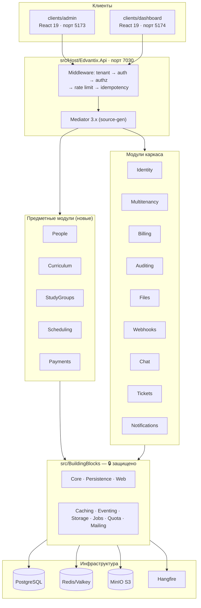

# Обзор архитектуры

← [[Edvantix]]

> [!info] Источник правды по конвенциям
> Технические правила кода — [`AGENTS.md`](../../AGENTS.md) и `.agents/rules/`.
> Здесь — как эти правила ложатся на предметную область Edvantix.

## Форма системы

**Модульный монолит** с вертикальными срезами (Vertical Slice Architecture).
Один процесс, одна база PostgreSQL, физически разделённые модули со своими схемами и
контрактами. Не микросервисы — но границы такие, что модуль можно вынести.



## Правила, которые нельзя нарушать

Полный список — «Golden rules» в [`AGENTS.md`](../../AGENTS.md). Критичное для нашей работы:

1. **Модуль ссылается на другой модуль только через `.Contracts`.** Проверяется
   `Architecture.Tests` (NetArchTest). `Scheduling` не видит внутренности `StudyGroups` —
   только `Modules.StudyGroups.Contracts`.
2. **Регистрация модуля затрагивает четыре места** — см. [[Регистрация модуля]].
   Пропущенный маркер Mediator = обработчики молча не находятся.
3. **Изоляция по тенанту включена по умолчанию** через `BaseDbContext`.
   Отключается только через `IGlobalEntity`. См. [[Мультитенантность]].
4. **`src/BuildingBlocks` не трогаем** без явного согласования — общий для всех модулей.
5. Обработчики Mediator — `public sealed`, возвращают `ValueTask<T>`, каждый `await`
   с `.ConfigureAwait(false)`.
6. Каждая команда и каждый пагинированный запрос имеют валидатор `{Name}Validator`.
7. `CancellationToken` пробрасывается во все EF/IO-вызовы.

## Анатомия предметного модуля

```
src/Modules/Scheduling/
├── Modules.Scheduling.Contracts/     ← единственный публичный API модуля
│   ├── v1/Commands/                     команды
│   ├── v1/Queries/                      запросы
│   ├── v1/DTOs/                         DTO ответов
│   ├── IntegrationEvents/               события для других модулей
│   └── SchedulingContractsMarker.cs     маркер сборки для Mediator
└── Modules.Scheduling/
    ├── SchedulingModule.cs           ← IModule + [assembly: FshModule(..., 620)]
    ├── Domain/                          сущности, доменные события
    ├── Data/                            DbContext, конфигурации, инициализатор
    ├── Features/v1/{Area}/{Action}/     срез: Handler + Validator + Endpoint
    ├── Events/                          обработчики доменных событий
    ├── IntegrationEventHandlers/        обработчики событий чужих модулей
    ├── Services/                        доменные сервисы (проверка конфликтов и т.п.)
    └── Jobs/                            Hangfire-задания
```

Один срез = одна папка. `CreateSessionCommandHandler.cs`, `CreateSessionCommandValidator.cs`,
`CreateSessionEndpoint.cs` лежат рядом.

## Границы данных

Каждый модуль — свой `DbContext` и своя схема PostgreSQL. Между модулями **нет FK**.
Связь по идентификаторам, целостность обеспечивается приложением.

| Модуль | Схема | Ключевые таблицы |
|---|---|---|
| [[Identity]] | `identity` | users, roles, groups, sessions |
| [[Multitenancy]] | `tenant` | tenants, themes |
| [[People]] | `people` | students, teachers, guardians |
| [[Curriculum]] | `curriculum` | subjects, courses, course_modules, lessons |
| [[StudyGroups]] | `study_groups` | study_groups, enrollments |
| [[Scheduling]] | `scheduling` | schedule_templates, sessions, attendance, rooms |
| [[Payments]] | `payments` | tariffs, student_invoices, payment_confirmations |
| [[Billing]] | `billing` | plans, subscriptions, invoices |
| [[Auditing]] | `audit` | audit_trails |
| [[Files]] | `files` | file_assets |

Кросс-модульные ссылки: `StudyGroup.CourseId` → Curriculum, `StudyGroup.TeacherId` → People,
`Session.StudyGroupId` → StudyGroups, `StudentInvoice.StudentId` → People. Все — «мягкие»,
без FK. Каскадные последствия обрабатываются через [[Интеграционные события]].

## Миграции

Все миграции — в `src/Host/Edvantix.Migrations.PostgreSQL`, по папке на модуль.
База **не мигрируется при старте API** — отдельный шаг `Edvantix.DbMigrator`:

```bash
dotnet run --project src/Host/Edvantix.DbMigrator -- apply --seed
```

## Асинхронная работа

- **Доменные события** — внутри модуля, в той же транзакции.
- **Интеграционные события** — между модулями через Outbox/Inbox. См. [[Интеграционные события]].
- **Hangfire** — периодические задания: генерация занятий из шаблонов, пересчёт просроченных
  счетов, напоминания о занятиях.

## Реальное время

- **SignalR** — чат ([[Chat]]), обновление расписания.
- **SSE** — лента уведомлений в dashboard.

## Стек

| Backend | | Frontend | |
|---|---|---|---|
| .NET 10 / C# latest | Mediator 3.x, FluentValidation 12 | React 19 + Vite 7 + TS 5 | TanStack Query v5 |
| EF Core 10 / PostgreSQL | Finbuckle 10 (multitenancy) | React Router 7 | Radix + Tailwind v4 |
| JWT + ASP.NET Identity | Redis, Hangfire | react-hook-form + zod (admin) | SignalR / SSE |
| OpenAPI + Scalar | Serilog + OpenTelemetry | Playwright (route-mocked) | рукописный `apiFetch` |
| .NET Aspire | xUnit, Shouldly, NSubstitute, Testcontainers | конфиг через `/config.json` | |

## Связанное

[[Карта модулей]] · [[Мультитенантность]] · [[Регистрация модуля]] · [[Интеграционные события]]
