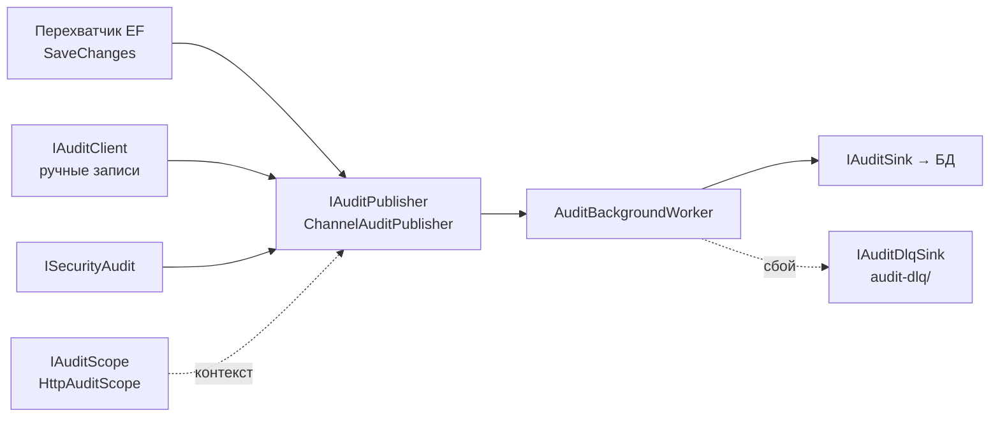

# Auditing

← [[Edvantix]] · [[Карта модулей]] · задачи: [[Задачи · Доработки каркаса]]

> ✅ Реализован · порядок `300` · схема `audit`

## Назначение

Журнал изменений, событий безопасности и исключений. Закрывает требование
«подробный аудит».

Ключевое свойство: **аудит нельзя обойти забывчивостью**. Разработчик не пишет вызовов
логирования — изменения перехватываются на уровне `SaveChanges`.

## Как устроено



Запись асинхронная — не тормозит запрос. Контекст (`HttpAuditScope`) добавляет
пользователя, тенанта, IP, correlation id и trace id. При недоступности хранилища
события уходят в dead-letter queue (`audit-dlq/`, в `.gitignore`).

## Контракты

`Modules.Auditing.Contracts`

### Типы событий

| Тип | Payload |
|---|---|
| Изменение сущности | `EntityChangeEventPayload` + `PropertyChange` (до/после) |
| Событие безопасности | `SecurityEventPayload` |
| Исключение | `ExceptionEventPayload` + `ExceptionSeverityClassifier` |
| Активность | `ActivityEventPayload` |

Общая оболочка — `AuditEnvelope`, интерфейс — `IAuditEvent`, перечисления — `AuditEnums`.

### Запросы

| Запрос | Возвращает |
|---|---|
| `GetAuditsQuery` | постраничный поиск с фильтрами |
| `GetAuditByIdQuery` | `AuditDetailDto` |
| `GetAuditsByCorrelationQuery` | вся цепочка одного запроса |
| `GetAuditsByTraceQuery` | связь с OpenTelemetry |
| `GetAuditSummaryQuery` | `AuditSummaryDto`, `AuditSummaryAggregateDto` |
| `GetSecurityAuditsQuery` | события безопасности |
| `GetExceptionAuditsQuery` | исключения |

### Точки расширения

| Интерфейс | Назначение |
|---|---|
| `IAuditClient` | ручная запись из обработчика |
| `ISecurityAudit` | события безопасности |
| `IAuditEnricher`, `IAuditMutatingEnricher` | обогащение записи контекстом |
| `IAuditMaskingService` | маскирование чувствительных полей |
| `IAuditSink`, `IAuditDlqSink` | назначение записи |
| `IAuditSerializer` | сериализация |
| `IAuditScope` | контекст запроса |

### Исключения из аудита

`NoAuditAttribute` — на сущности или свойстве.
`NoAuditEndpointExtensions` — отключение для конкретного эндпоинта
(например, health-check, который иначе засорит журнал).

### Настройки

`AuditHttpOptions` — что писать из HTTP-контекста.
`AuditRetentionOptions` — срок хранения записей.

## Права

`AuditingPermissions`, ресурс `AuditTrails`. Кросс-тенантный просмотр —
`SystemPermissions.Platform.Audits` (`IsRoot: true`).

## HTTP API

```
GET    /api/v1/audits
GET    /api/v1/audits/by-entity/{entityName}/{entityId}
GET    /api/v1/audits/{id}
GET    /api/v1/audits/correlation/{correlationId}
GET    /api/v1/audits/trace/{traceId}
GET    /api/v1/audits/summary
GET    /api/v1/audits/security
GET    /api/v1/audits/exceptions
```

### История одной сущности

`GET /api/v1/audits/by-entity/{entityName}/{entityId}` — «история этого ученика/счёта/
занятия» для карточки сущности. Тонкая оболочка над `GetAuditsQuery`: подставляет
`EntityName` и собирает унифицированный `EntityKey = "Id:{entityId}"`, постранично и с
окном дат как у `GET /audits`. Для составных ключей (`TenantId:1|UserId:42`) —
`GET /audits?entityName=…&entityKey=…` напрямую. Фильтр идёт по `jsonb`-полям
`EntityChangeEventPayload.EntityName`/`.Key` (`AsText`+`ILIKE`, как security/exception),
схема `AuditRecords` не меняется.

## Что аудируется в Edvantix

Автоматически — изменения всех сущностей всех модулей. Критичные для школы:

| Действие | Почему важно |
|---|---|
| `PaymentConfirmation` создано / сторнировано | утверждение о деньгах без внешней проверки ([[Payments]]) |
| `StudentInvoice` выставлен / отменён | финансовый документ |
| `Attendance` изменена задним числом | основание для начислений |
| `Session` отменено / перенесено | предмет претензий |
| `GroupEnrollment` создано / закрыто | влияет на деньги и доступ |
| Изменение ролей и прав, имперсонация | безопасность |
| `StudentNote` | персональные данные |

## Границы

Аудит фиксирует **изменения данных**, а не намерения. «Почему перенесли занятие» —
это поле `Session.CancelReason` в домене, а не задача аудита.

## Зависимости

**Ссылается на:** `Identity.Contracts`, `Multitenancy.Contracts`, `BuildingBlocks`.

**На него ссылаются:** никто напрямую — модули пишут через перехватчик или `IAuditClient`.

## Связанное

[[Модель прав доступа]] · [[Payments]] · `.agents/rules/modules/auditing.md` · `.agents/rules/logging.md`
