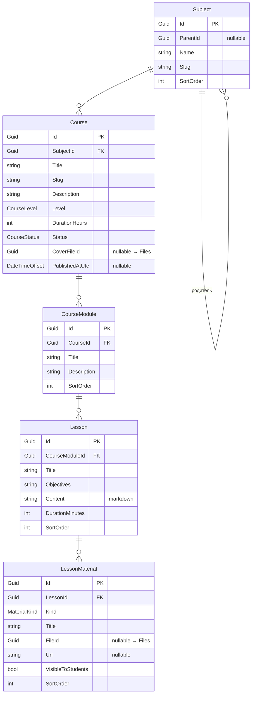

# Curriculum

← [[Edvantix]] · [[Карта модулей]] · задачи: [[Задачи · Новые модули]]

> ✅ Реализован · порядок `600` · схема `curriculum`
>
> Домен, миграция, CRUD/дерево/поиск для пяти сущностей, публикация/архивация/дублирование/
> корзина курса, перестановка на каждом уровне, материалы урока с CHECK-ограничением,
> `LessonMaterialAccessPolicy`, `ICourseQueryService`, три интеграционных события — всё сделано.
> `dotnet build` — 0 предупреждений/0 ошибок, `Architecture.Tests` — 51/51,
> `Curriculum.Tests` (юнит) — 25/25, интеграционные тесты изоляции тенантов — 5/5 (плюс контроль:
> People 7/7 и Catalog без регрессии — суммарно 114/114 в общем прогоне).
>
> Проектные решения, принятые при реализации (плоская персистентность вместо вложенного
> агрегата, мягкое удаление только у `Course`, семантика дублирования и т.д.) — подробно в
> [[Задачи · Новые модули]] → Curriculum → «Проектные решения», кратко — в
> `.agents/rules/modules/curriculum.md`.

> [!note] Провижининг новой школы — два дефолтных направления, 2026-08-27
> `CurriculumDbInitializer.SeedAsync` пересмотрен: было "Curriculum has no per-tenant reference
> data to seed — subjects and courses are authored by the school's methodist through the API, not
> pre-populated" (сознательный no-op), стало — сидирование двух верхнеуровневых `Subject`
> («Английский язык», «Математика») при провижининге каждой новой школы. Причина пересмотра —
> задача [[Multitenancy]] → «Шаги провижининга под новые модули»: `CreateCourseCommand` требует
> `SubjectId`, то есть без хотя бы одного направления методист не может создать первый курс через
> API/UI без отдельного обращения в поддержку. Курсы по-прежнему никогда не создаются автоматически
> — только верхушка дерева `Subject`. Идемпотентно по `Subject.Slug` (по образцу
> `IdentityDbInitializer`'а — «проверить перед вставкой»), безопасно при повторных запусках
> провижининга. Подробности и обоснование выбора имён/`Kind` — в самом `CurriculumDbInitializer.cs`
> и в [[Задачи · Доработки каркаса]] → Multitenancy.

## Назначение

Учебная программа: направления → курсы → разделы → уроки → материалы.
Всё это **шаблоны** вне времени и людей. Даты появляются в [[Scheduling]],
ученики — в [[StudyGroups]].

Занимает порядок `600`, освободившийся после удаления Catalog
([[ADR-002 Catalog заменяется на Curriculum]]).

## Домен



### Перечисления

`CourseLevel` — `Beginner` `Elementary` `Intermediate` `Advanced`
`CourseStatus` — `Draft` `Published` `Archived`
`MaterialKind` — `File` `Video` `Link` `Homework` `Presentation`

### Инварианты

- Группу в [[StudyGroups]] можно создать только по курсу в статусе `Published`.
- `Archived` не ломает существующие группы — запрещает лишь новые.
- Урок обязательно принадлежит разделу. Курс без разделов недопустим: при плоской
  программе создаётся один раздел «Основной». Это проще, чем поддерживать
  `Lesson.CourseId` и `Lesson.CourseModuleId` одновременно.
- Ровно одно из `FileId` / `Url` заполнено — валидатор + CHECK-ограничение.
- `VisibleToStudents = false` — материал только для преподавателя (ключи, методичка).
- `SortOrder` — плотная последовательность, пересчитывается при перестановке.
- Удаление урока, на который ссылаются проведённые занятия, запрещено — только
  архивация ([[ADR-006 Урок программы и занятие расписания]]).

> [!important] `Lesson` — не занятие
> Урок программы не имеет даты, преподавателя и учеников. Занятие в календаре —
> `Session` в [[Scheduling]]. Одна `Lesson` порождает столько `Session`, сколько
> групп проходят курс.

### Чего в модели нет намеренно

Цена курса. Один курс продаётся помесячно, за пакет и индивидуально —
это `Tariff` в [[Payments]], а не свойство курса.

## Контракты

`Modules.Curriculum.Contracts`

### Команды

| Команда | Область |
|---|---|
| `CreateSubjectCommand` · `UpdateSubjectCommand` · `DeleteSubjectCommand` · `ReorderSubjectsCommand` | Subjects |
| `CreateCourseCommand` · `UpdateCourseCommand` · `DeleteCourseCommand` | Courses |
| `PublishCourseCommand` · `ArchiveCourseCommand` · `DuplicateCourseCommand` · `RestoreCourseCommand` | Courses |
| `CreateCourseModuleCommand` · `UpdateCourseModuleCommand` · `DeleteCourseModuleCommand` · `ReorderCourseModulesCommand` | Modules |
| `CreateLessonCommand` · `UpdateLessonCommand` · `DeleteLessonCommand` · `ReorderLessonsCommand` | Lessons |
| `AddLessonMaterialCommand` · `RemoveLessonMaterialCommand` · `ReorderLessonMaterialsCommand` | Materials |

### Запросы

| Запрос | Возвращает |
|---|---|
| `GetSubjectTreeQuery` | `IReadOnlyList<SubjectNodeDto>` |
| `SearchCoursesQuery` | `PagedList<CourseDto>` — фильтры: направление, статус, уровень |
| `GetCourseByIdQuery` | `CourseDetailDto` — с разделами и уроками |
| `GetLessonByIdQuery` | `LessonDto` |
| `GetLessonMaterialsQuery` | `IReadOnlyList<LessonMaterialDto>` |
| `ListTrashedCoursesQuery` | `PagedList<CourseDto>` |

### DTO

`SubjectDto` · `SubjectNodeDto` · `CourseDto` · `CourseDetailDto` ·
`CourseModuleDto` · `LessonDto` · `LessonMaterialDto`

### Публикуемые события

| Событие | Содержимое |
|---|---|
| `CoursePublishedIntegrationEvent` | `CourseId`, `Title`, `SubjectId` |
| `CourseArchivedIntegrationEvent` | `CourseId` |
| `LessonMaterialAddedIntegrationEvent` | `LessonId`, `MaterialId`, `Kind` |

### Сервисы для других модулей

```csharp
public interface ICourseQueryService
{
    ValueTask<CourseBriefDto?> GetBriefAsync(Guid courseId, CancellationToken ct = default);
    ValueTask<bool> IsPublishedAsync(Guid courseId, CancellationToken ct = default);
    ValueTask<IReadOnlyList<LessonBriefDto>> GetLessonsInOrderAsync(
        Guid courseId, CancellationToken ct = default);
}
```

`IsPublishedAsync` нужен [[StudyGroups]] при создании группы, `GetLessonsInOrderAsync` —
[[Scheduling]] при привязке уроков к сгенерированным занятиям.

### Подписки

Нет.

## Права

| Ресурс | Действия |
|---|---|
| `Subjects` | `View` `Create` `Update` `Delete` |
| `Courses` | `View` `Create` `Update` `Delete` `Publish` `Restore` `ViewTrash` |
| `Lessons` | `View` `Create` `Update` `Delete` |
| `LessonMaterials` | `View` `Manage` |

`Courses.Publish` отдельно: черновик правит методист, публикацию утверждает
администратор.

## HTTP API

Плоский роутинг без сегмента `/curriculum` — как у [[People]], не как у Catalog.

```
GET    /api/v1/subjects/tree
POST   /api/v1/subjects
PUT    /api/v1/subjects/{id}
DELETE /api/v1/subjects/{id}
PUT    /api/v1/subjects/order                  ReorderSubjectsCommand

GET    /api/v1/courses/trash                   ListTrashedCoursesQuery (право Courses.ViewTrash)
GET    /api/v1/courses
POST   /api/v1/courses
GET    /api/v1/courses/{id}
PUT    /api/v1/courses/{id}
DELETE /api/v1/courses/{id}
POST   /api/v1/courses/{id}/publish
POST   /api/v1/courses/{id}/archive
POST   /api/v1/courses/{id}/duplicate
POST   /api/v1/courses/{id}/restore

POST   /api/v1/courses/{id}/modules
PUT    /api/v1/modules/{id}
DELETE /api/v1/modules/{id}
PUT    /api/v1/courses/{id}/modules/reorder

POST   /api/v1/modules/{id}/lessons
PUT    /api/v1/lessons/{id}
DELETE /api/v1/lessons/{id}
GET    /api/v1/lessons/{id}
PUT    /api/v1/modules/{id}/lessons/reorder

GET    /api/v1/lessons/{id}/materials
POST   /api/v1/lessons/{id}/materials
DELETE /api/v1/materials/{id}
PUT    /api/v1/lessons/{id}/materials/reorder
```

`duplicate` — рабочий сценарий: школы правят программу от потока к потоку, а менять
курс, по которому уже идут занятия, рискованно. Модули (разделы) курса не имеют отдельного
ресурса прав — их CRUD и перестановка гейтятся `Courses.Update`.

## Зависимости

**Ссылается на:** `Identity.Contracts`, `Multitenancy.Contracts`, `Files.Contracts`.

**На него ссылаются:** [[StudyGroups]] (`CourseId`), [[Scheduling]] (`LessonId`),
[[Payments]] (`Tariff.CourseId`).

## Связанное

[[ADR-002 Catalog заменяется на Curriculum]] · [[ADR-006 Урок программы и занятие расписания]] · [[Задачи · Новые модули]]
