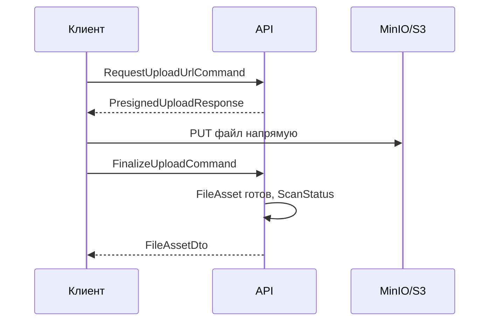

# Files

← [[Edvantix]] · [[Карта модулей]] · задачи: [[Бэклог]]

> ✅ Реализован · порядок `350` · схема `files`

## Назначение

Файлы и объектное хранилище (S3-совместимое, локально MinIO). Загрузка по presigned
URL — байты идут в хранилище мимо API.

## Домен

| Сущность | Назначение |
|---|---|
| `FileAsset` | метаданные: имя, тип, размер, владелец, видимость, привязка |
| `ScanStatus` | статус антивирусной проверки |

Доменные события: `FileFinalizedDomainEvent`, `FileSoftDeletedDomainEvent`.

## Поток загрузки



Скачивание симметрично: `GetFileDownloadUrlQuery` → `PresignedDownloadResponse`.

## Контракты

`Modules.Files.Contracts`

### Команды

`RequestUploadUrlCommand` · `FinalizeUploadCommand` · `ChangeFileVisibilityCommand` ·
`DeleteFileCommand` · `RestoreFileCommand`

### Запросы

`GetFileMetadataQuery` · `GetFileDownloadUrlQuery` · `ListMyFilesQuery` ·
`ListSharedFilesQuery` · `ListTrashedFilesQuery`

### DTO

`FileAssetDto` · `FileAssetStatus` · `Visibility` · `PresignedUploadResponse` ·
`PresignedDownloadResponse` · `FileAssetReference`

### Публикуемые события

`FileFinalizedIntegrationEvent`

### Точка расширения

```csharp
public interface IFileAccessPolicy { /* … */ }
```

Модуль-владелец файла решает, кому его отдавать. Реализация регистрируется
владельцем, а не Files. Пример в стартер-ките — `ProductFileAccessPolicy` в Catalog;
для Edvantix нужны политики материалов уроков и чеков об оплате.

## Права

`FilesPermissions`, ресурс `Files`:

| Действие | Basic |
|---|---|
| `Upload` | ✔ |
| `DeleteOwn` | ✔ |
| `DeleteAny` | |
| `ViewTrash` | |
| `Restore` | |

## HTTP API

```
POST   /api/v1/files/upload-url
POST   /api/v1/files/finalize
GET    /api/v1/files/{id}
GET    /api/v1/files/{id}/download-url
PUT    /api/v1/files/{id}/visibility
DELETE /api/v1/files/{id}
POST   /api/v1/files/{id}/restore
GET    /api/v1/files/mine
GET    /api/v1/files/shared
GET    /api/v1/files/trash
```

## Что хранится в Edvantix

| Что | Модуль-владелец | Кто видит |
|---|---|---|
| Материалы уроков | [[Curriculum]] | ученики групп, проходящих урок; при `VisibleToStudents = false` — только преподаватель |
| Обложки курсов | [[Curriculum]] | все внутри школы |
| Аватары | [[People]] | все внутри школы |
| Чеки об оплате | [[Payments]] | менеджеры и плательщик |
| PDF счетов | [[Payments]] | менеджеры и плательщик |
| Вложения в чате | [[Chat]] | участники канала |

Каждому владельцу нужна своя реализация `IFileAccessPolicy`.

### Ограничение типов и размера по категориям

Загрузка проходит через категорию (`Files:Categories` в конфиге) с белым списком
расширений и потолком размера. Категория может быть **привязана к типам владельцев**
(`OwnerTypes`): такая привязка симметрична и проверяется в `RequestUploadUrl`
(`FileCategoryPolicy`) — перечисленные типы владельцев загружают файлы **только** через
привязанную категорию, а сама категория отклоняет любой другой тип владельца.

Материалы уроков (`OwnerType = LessonMaterial`) привязаны к категории `LessonMaterial`:
документы, изображения, аудио, архивы; **видео-контейнеры исключены намеренно** — записи
занятий добавляются как `MaterialKind = Video` со ссылкой на внешний хостинг
([[Curriculum]] → «Материалы урока»), а не прямой загрузкой гигабайтов в MinIO. Потолок —
25 МиБ.

### Лимит объёма по тарифному плану

Сверх потолка категории действует квота хранилища школы — `QuotaResource.StorageBytes`,
лимит из `QuotaOptions.Plans[<план>]` (2 ГиБ на `free`, 50 ГиБ на `pro`/`pro-annual`).
`RequestUploadUrlCommandHandler` делает пред-проверку `IQuotaService.CheckAsync` (при
превышении — **HTTP 507**, URL не выдаётся), `FinalizeUploadCommandHandler` списывает
фактический размер, `PurgeDeletedFilesJob` возвращает при жёсткой очистке. Включается
`QuotaOptions.Enabled` (в Development выключено).

## Зависимости

**Ссылается на:** `Identity.Contracts`, `Multitenancy.Contracts`,
`BuildingBlocks/Storage`, `BuildingBlocks/Quota`.

**На него ссылаются:** [[Curriculum]], [[People]], [[Payments]], [[Chat]], [[Tickets]].

## Связанное

[[Curriculum]] · [[Payments]] · `.agents/rules/modules/files.md` · `.agents/rules/storage.md`
