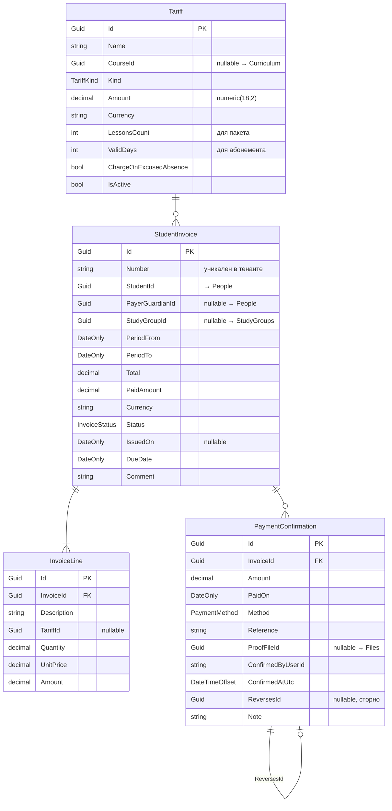

# Payments

← [[Edvantix]] · [[Карта модулей]] · задачи: [[Задачи · Новые модули]]

> 🟡 Проектируется · порядок `630` · схема `payments`

## Назначение

Деньги **внутри** школы: ученик платит школе. Тарифы, счета, ручное подтверждение
оплаты. Подписка школы на платформу — это [[Billing]], другой модуль
([[ADR-004 Payments отдельно от Billing]]).

> [!danger] Платёжного шлюза нет
> Система фиксирует **обязательство** и **факт его закрытия человеком**. Деньги идут
> мимо платформы: касса, перевод, эквайринг банка.
>
> Следствие, встроенное в модель: `PaymentConfirmation` — утверждение менеджера,
> ничем не проверяемое. Поэтому записи неудаляемы, каждая пишется в [[Auditing]],
> а отмена оформляется сторнирующей записью, а не редактированием.

## Домен



### Перечисления

`TariffKind` — `PerLesson` `PerMonth` `PerPackage` `OneTime`
`InvoiceStatus` — `Draft` `Issued` `PartiallyPaid` `Paid` `Cancelled`
`PaymentMethod` — `Cash` `BankTransfer` `Card` `Online` `Other`

### Инварианты

- `Total = Σ InvoiceLine.Amount`; `InvoiceLine.Amount = Quantity × UnitPrice`.
- `PaidAmount = Σ PaymentConfirmation.Amount`, сторно учитывается со знаком минус.
- Статус **выводится** из сумм, вручную не задаётся: `0` → `Issued`;
  `0 < PaidAmount < Total` → `PartiallyPaid`; `>= Total` → `Paid`.
- `Overdue` **не хранится** — вычисляется как `Status ∈ {Issued, PartiallyPaid}`
  и `DueDate < сегодня`. Иначе понадобилось бы задание, ежедневно переписывающее строки.
- `Draft` правится свободно; после `Issued` строки неизменяемы — только отмена
  и новый счёт. Это документ, а не черновик.
- `Cancelled` возможен только при `PaidAmount = 0`; иначе — сторнирование.
- Переплата допускается: разница идёт в баланс ученика как аванс.
- Валюта одна на тенант (`TenantSettings.Currency`).
- Деньги — `decimal(18,2)` / `numeric(18,2)`, никогда `double`. Округление
  `MidpointRounding.AwayFromZero`.

### Модель начисления

| Тариф | Как считается | Источник данных |
|---|---|---|
| `PerMonth` | фиксированная сумма за месяц; при зачислении или отчислении посреди месяца — пропорционально числу запланированных занятий | `ISessionPlanQueryService` ([[Scheduling]]) |
| `PerLesson` | сумма × число **проведённых** занятий | `IAttendanceQueryService.CountHeldSessionsAsync` |
| `PerPackage` | предоплата за N занятий, списание по мере проведения | остаток пакета — проекция |
| `OneTime` | разовый счёт: учебник, экзамен, пробное | — |

Пропуск при `PerLesson` начисляется, если статус не `Excused`; поведение управляется
флагом `Tariff.ChargeOnExcusedAbsence`. Отменённое занятие не начисляется никогда.

### Баланс

`StudentBalance` — не таблица, а проекция по счетам и подтверждениям:
`charged`, `paid`, `debt`, `advance`, `overdueInvoices[]`. Хранить агрегат опасно —
рассинхронизируется. При проблемах с производительностью — материализованное
представление, но не денормализованное поле.

## Контракты

`Modules.Payments.Contracts`

### Команды

| Команда | Область |
|---|---|
| `CreateTariffCommand` · `UpdateTariffCommand` · `DeactivateTariffCommand` | Tariffs |
| `CreateStudentInvoiceCommand` · `UpdateStudentInvoiceCommand` | Invoices — правка только в `Draft` |
| `BulkGenerateInvoicesCommand` | Invoices — по группе за период, идемпотентна |
| `IssueInvoiceCommand` · `BulkIssueInvoicesCommand` · `CancelInvoiceCommand` | Invoices |
| `ConfirmPaymentCommand` | Payments |
| `ReversePaymentCommand` | Payments — сторно, право `SchoolAdmin` |

### Запросы

| Запрос | Возвращает |
|---|---|
| `SearchStudentInvoicesQuery` | статус, группа, период, наличие долга |
| `GetStudentInvoiceByIdQuery` | `StudentInvoiceDetailDto` — строки и оплаты |
| `GetMyInvoicesQuery` | свои счета / счета подопечных |
| `GetInvoicePdfQuery` | поток PDF |
| `GetInvoicePaymentsQuery` | `IReadOnlyList<PaymentConfirmationDto>` |
| `GetStudentBalanceQuery` | `StudentBalanceDto` |
| `GetDebtorsReportQuery` | должники по школе |
| `GetRevenueReportQuery` | поступления за период |
| `GetTariffsQuery` | справочник |

### DTO

`TariffDto` · `StudentInvoiceDto` · `StudentInvoiceDetailDto` · `InvoiceLineDto` ·
`PaymentConfirmationDto` · `StudentBalanceDto` · `DebtorDto` · `RevenueReportDto`

### Публикуемые события

| Событие | Содержимое |
|---|---|
| `StudentInvoiceIssuedIntegrationEvent` | `InvoiceId`, `StudentId`, `PayerGuardianId?`, `Total`, `DueDate` |
| `StudentPaymentConfirmedIntegrationEvent` | `InvoiceId`, `Amount`, `PaidOn`, `Method` |
| `StudentInvoiceCancelledIntegrationEvent` | `InvoiceId`, `Reason` |
| `StudentInvoiceOverdueIntegrationEvent` | `InvoiceId`, `StudentId`, `Debt`, `DaysOverdue` |

### Подписки

| Событие | Реакция |
|---|---|
| `SessionHeldIntegrationEvent` (Scheduling) | накопление для потарифного начисления |
| `SessionCancelledIntegrationEvent` | исключить из начислений |
| `StudentEnrolledIntegrationEvent` (StudyGroups) | начать тарификацию |
| `StudentUnenrolledIntegrationEvent` | остановить тарификацию |
| `StudentArchivedIntegrationEvent` (People) | прекратить начисления; задолженность сохраняется |

Все обработчики идемпотентны: доставка «минимум один раз», повторный
`StudentPaymentConfirmed` не должен создать вторую отметку.

## Права

| Ресурс | Действия |
|---|---|
| `Tariffs` | `View` `Manage` |
| `StudentInvoices` | `View` `ViewOwn` `Create` `Issue` `Cancel` `Export` |
| `StudentPayments` | `View` `Confirm` `Revoke` |

> [!important] `StudentPayments.Confirm` — самое чувствительное право в системе
> Означает «объявить, что деньги получены», без внешней проверки. Выдавать только
> доверенным менеджерам. `Revoke` вынесено отдельно на уровень `SchoolAdmin`.

## HTTP API

```
GET    /api/v1/tariffs                                + CRUD

GET    /api/v1/student-invoices
POST   /api/v1/student-invoices
POST   /api/v1/student-invoices/bulk-generate
GET    /api/v1/student-invoices/{id}
PUT    /api/v1/student-invoices/{id}
POST   /api/v1/student-invoices/{id}/issue
POST   /api/v1/student-invoices/{id}/cancel
POST   /api/v1/student-invoices/bulk-issue
GET    /api/v1/student-invoices/{id}/pdf
GET    /api/v1/student-invoices/my

POST   /api/v1/student-invoices/{id}/payments
GET    /api/v1/student-invoices/{id}/payments
POST   /api/v1/payments/{id}/reverse

GET    /api/v1/students/{id}/balance
GET    /api/v1/reports/debtors
GET    /api/v1/reports/revenue
```

Массовое выставление — главный сценарий менеджера:

```jsonc
POST /api/v1/student-invoices/bulk-generate
{ "studyGroupId": "…", "periodFrom": "2026-03-01", "periodTo": "2026-03-31",
  "dueDate": "2026-03-10", "issueImmediately": false }
```

Создаёт `Draft` на каждого активного ученика по его тарифу
(`GroupEnrollment.TariffId`, иначе тариф курса). `issueImmediately: false` по
умолчанию — сначала проверка глазами. Повторный вызов за тот же период возвращает
существующие черновики.

PDF рендерится через `IInvoicePdfRenderer` — интерфейс переиспользуется из [[Billing]],
реализация под школьный счёт своя.

## Задания Hangfire

| Задание | Расписание | Что делает |
|---|---|---|
| `DetectOverdueInvoicesJob` | ежедневно | публикует `StudentInvoiceOverdue` |
| `MonthlyInvoiceDraftJob` | 1-го числа | черновики помесячных счетов, если включено |
| `PaymentReminderJob` | ежедневно | напоминания за N дней до `DueDate` |

## Зависимости

**Ссылается на:** `People.Contracts`, `StudyGroups.Contracts`, `Scheduling.Contracts`,
`Curriculum.Contracts`, `Files.Contracts`, `Identity.Contracts`, `Multitenancy.Contracts`.

**Подписаны на его события:** [[Notifications]], [[Webhooks]], [[Auditing]].

## Связанное

[[ADR-004 Payments отдельно от Billing]] · [[Billing]] · [[Scheduling]] · [[Задачи · Новые модули]] · [[Открытые вопросы]]
