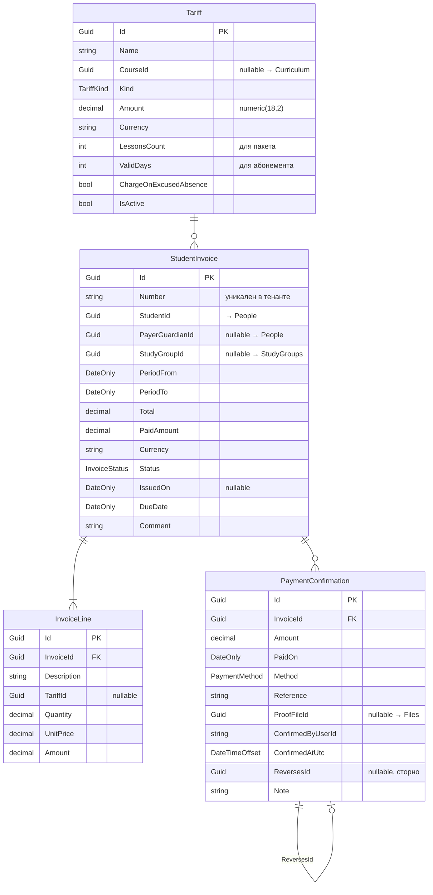

# Payments

← [[Edvantix]] · [[Карта модулей]] · задачи: [[Бэклог]]

> ✅ Реализован · порядок `630` · схема `payments`
>
> Домен (`Tariff` — плоская сущность; `StudentInvoice` — агрегат, владеет `Lines`/`Payments`;
> статус выводится из сумм, никогда не задаётся напрямую), миграция, CRUD тарифов,
> черновики/массовая генерация счетов (`ITariffAccrualService` — все 4 вида тарифа, включая
> пропорциональный `PerMonth` и `PerLesson` с учётом `ChargeOnExcusedAbsence`), выставление/
> отмена, подтверждение/сторнирование оплат (`ProofFileId` через `IFileAccessPolicy`), баланс
> ученика (включая остаток пакета для `PerPackage` — см. ниже) и отчёты (должники/поступления),
> PDF счёта, 5 интеграционных событий (4 из справочника + `StudentInvoiceDueSoonIntegrationEvent`
> под `PaymentReminderJob` — добавлено сверх исходного списка, см. ниже), избирательные подписки
> на Scheduling/StudyGroups/People (`IDraftInvoiceRefreshService` держит ещё не выставленные
> черновики в актуальном состоянии; `StudentEnrolled` — сознательный no-op), три
> Hangfire-задания. `Payments.Tests` — 41/41 (арифметика начислений, оплат и остатка пакета).
> Ретроспектива этапа и рисков — [[Этапы внедрения]] → «Этап 5 · Payments». Frontend
> реализован (PR #21).
>
> **Два отклонения от исходного плана этого справочника**, оба изменяют только реализацию,
> не наблюдаемое поведение:
> 1. «PDF рендерится через `IInvoicePdfRenderer` — интерфейс переиспользуется из [[Billing]]»
>    (ниже, раздел «HTTP API») — невозможно буквально: интерфейс лежит в рантайм-неймспейсе
>    `Modules.Billing.Services`, не в `Modules.Billing.Contracts`, ссылка нарушила бы границу
>    модулей. Payments объявляет свой независимый интерфейс/реализацию на QuestPDF.
> 2. `StudentInvoiceDueSoonIntegrationEvent` добавлен сверх четырёх событий из раздела
>    «Публикуемые события» — `PaymentReminderJob` («напоминания за N дней до `DueDate`»,
>    раздел «Задания Hangfire») без события-носителя не имел смысла.
>
> [!note] Остаток пакета для `PerPackage` реализован — 2026-08-24, закрывает известный пробел
> Исходно `TariffAccrualService` начисляло весь пакет одной строкой и оставляло остаток как
> «проекция» — без реализации (закрыто в PR #9).
> Выбрана проекция на лету (вариант (a) из формулировки задачи), не отдельный ledger:
> `GetStudentBalanceQueryHandler` считает `UsedCount` через уже существующий
> `IAttendanceQueryService.CountHeldSessionsAsync`, тем же способом, каким уже считаются
> `Overdue` и весь `StudentBalance` — «не хранить, что можно посчитать». Ledger-вариант (b) был
> отклонён: `SessionHeldIntegrationEventHandler` в Payments уже существует и намеренно не
> трогает выставленные `PerPackage`-строки (`DraftInvoiceRefreshService`: "OneTime/PerPackage
> lines are fixed at generation time by design") — заводить второй, декрементируемый канал
> состояния поверх уже сознательно неизменяемых строк добавило бы рассинхронизацию, а не убрало
> её. Три решения, принятые по ходу (подробности — «Баланс» ниже):
> 1. **Нет единого «активного» пакета** — у `GetStudentBalanceQuery` нет FIFO/LIFO выбора между
>    несколькими `PerPackage`-счетами одного ученика/группы; каждый неотменённый счёт-пакет
>    отдаётся отдельной записью `PackageBalanceDto`. Упрощает модель ценой редкого краевого
>    случая: если школа держит два параллельно действующих пакета с пересекающимися окнами
>    `[IssuedOn, ExpiresOn)`, одно и то же проведённое занятие засчитается в обоих.
>    Принято сознательно — параллельные пакеты на одну группу/ученика не типичный сценарий.
> 2. **`Tariff.ValidDays` — окно сгорания.** `0` → пакет бессрочен; иначе окно подсчёта —
>    `[IssuedOn, IssuedOn + ValidDays]`. После истечения `RemainingCount` замораживается на
>    значении на момент истечения — новые проведённые занятия к сгоревшему пакету не
>    привязываются (и не списываются с него).
> 3. **Верхняя граница окна, пока пакет не истёк — не «сегодня».** `CountHeldSessionsAsync`
>    считает по статусу `Held`, не по дате; искусственный потолок «сегодня» отбрасывал бы
>    корректно помеченные `Held`-занятия, если часы разъехались или отметку сделали чуть раньше
>    официального времени урока. Верхняя граница активного (неистёкшего) окна не ограничена.

> [!note] Провижининг новой школы — один дефолтный тариф, 2026-08-27
> `PaymentsDbInitializer.SeedAsync` пересмотрен: было "tariffs are created by the school through
> the API, not pre-populated (same reasoning as People/Curriculum/StudyGroups)" (сознательный
> no-op), стало — сидирование одного `Tariff` («Базовый тариф») при провижининге каждой новой
> школы, по той же задаче [[Multitenancy]] → «Шаги провижининга под новые модули». `Kind =
> OneTime` — единственный вид тарифа, которому не нужны ни начисление по расписанию/посещаемости
> (`PerLesson`/`PerMonth` через `ITariffAccrualService` дают осмысленное число только когда у
> школы уже настроены курсы/группы/занятия), ни доп. поля пакета (`LessonsCount`/`ValidDays` у
> `PerPackage`, явно исключённого из дефолта задачей). `CourseId: null` — тариф не привязан к
> курсу и не зависит от результата сидирования Curriculum (два независимых `IDbInitializer`,
> порядок вызова между модулями не гарантирован). `Amount = 0m` — намеренная заглушка: у кода нет
> основания угадывать цену школы, а ненулевое число выглядело бы как настроенное, а не как
> «отредактируйте меня». `Currency` берётся из `ITenantSettingsService.GetCurrentAsync()` (уже
> сидированного к этому моменту — см. [[Multitenancy]] → «TenantSettings реализовано»), не
> хардкодом `"USD"`. Идемпотентно по `Tariff.Name` (по образцу `IdentityDbInitializer`'а —
> «проверить перед вставкой»). Подробности — в самом `PaymentsDbInitializer.cs` и в
> [[Multitenancy]] → «TenantSettings».

## Назначение

Деньги **внутри** школы: ученик платит школе. Тарифы, счета, ручное подтверждение
оплаты. Подписка школы на платформу — это [[Billing]], другой модуль
([[ADR-004 Payments отдельно от Billing]]).

> [!danger] Платёжного шлюза нет
> Система фиксирует **обязательство** и **факт его закрытия человеком**. Деньги идут
> мимо платформы: касса, перевод, эквайринг банка.
>
> Следствие, встроенное в модель: `PaymentConfirmation` — утверждение менеджера,
> ничем не проверяемое. Поэтому записи неудаляемы, каждая пишется в [[Auditing]],
> а отмена оформляется сторнирующей записью, а не редактированием.

## Домен



### Перечисления

`TariffKind` — `PerLesson` `PerMonth` `PerPackage` `OneTime`
`InvoiceStatus` — `Draft` `Issued` `PartiallyPaid` `Paid` `Cancelled`
`PaymentMethod` — `Cash` `BankTransfer` `Card` `Online` `Other`

### Инварианты

- `Total = Σ InvoiceLine.Amount`; `InvoiceLine.Amount = Quantity × UnitPrice`.
- `PaidAmount = Σ PaymentConfirmation.Amount`, сторно учитывается со знаком минус.
- Статус **выводится** из сумм, вручную не задаётся: `0` → `Issued`;
  `0 < PaidAmount < Total` → `PartiallyPaid`; `>= Total` → `Paid`.
- `Overdue` **не хранится** — вычисляется как `Status ∈ {Issued, PartiallyPaid}`
  и `DueDate < сегодня`. Иначе понадобилось бы задание, ежедневно переписывающее строки.
- `Draft` правится свободно; после `Issued` строки неизменяемы — только отмена
  и новый счёт. Это документ, а не черновик.
- `Cancelled` возможен только при `PaidAmount = 0`; иначе — сторнирование.
- Переплата допускается: разница идёт в баланс ученика как аванс.
- Валюта одна на тенант (`TenantSettings.Currency`).
- Деньги — `decimal(18,2)` / `numeric(18,2)`, никогда `double`. Округление
  `MidpointRounding.AwayFromZero`.

### Модель начисления

| Тариф | Как считается | Источник данных |
|---|---|---|
| `PerMonth` | фиксированная сумма за месяц; при зачислении или отчислении посреди месяца — пропорционально числу запланированных занятий | `ISessionPlanQueryService` ([[Scheduling]]) |
| `PerLesson` | сумма × число **проведённых** занятий | `IAttendanceQueryService.CountHeldSessionsAsync` |
| `PerPackage` | предоплата за N занятий одной строкой при выставлении счёта; списание — не начисление, а отдельная read-side проекция остатка (см. «Баланс») | `IAttendanceQueryService.CountHeldSessionsAsync` |
| `OneTime` | разовый счёт: учебник, экзамен, пробное | — |

Пропуск при `PerLesson` начисляется, если статус не `Excused`; поведение управляется
флагом `Tariff.ChargeOnExcusedAbsence`. Отменённое занятие не начисляется никогда.

### Баланс

`StudentBalance` — не таблица, а проекция по счетам и подтверждениям:
`charged`, `paid`, `debt`, `advance`, `overdueInvoices[]`, `packages[]`. Хранить агрегат опасно —
рассинхронизируется. При проблемах с производительностью — материализованное
представление, но не денормализованное поле.

`packages[]` (`PackageBalanceDto`) — остаток по каждому `PerPackage`-счёту ученика. Считается
живьём в `GetStudentBalanceQueryHandler`, не хранится:

- **По одной записи на каждый неотменённый/невыставленный-в-`Draft` счёт**, чья единственная
  строка ссылается на тариф `PerPackage` (то же распознавание «строка = один тариф», каким уже
  пользуется `IDraftInvoiceRefreshService` для строк, которые можно безопасно пересчитать —
  вручную отредактированные многострочные счета в проекцию не попадают). Нет выбора «активного»
  пакета (не FIFO/LIFO) — при нескольких одновременных пакетах на группу/ученика отдаются все,
  каждый посчитан независимо; см. примечание в начале файла для обоснования и известного
  краевого случая (двойной учёт занятия при пересекающихся окнах).
- `UsedCount` = `IAttendanceQueryService.CountHeldSessionsAsync(studentId, studyGroupId, from:
  IssuedOn, to: …)` — окно начинается с даты выставления счёта (не с периода счёта).
  `RemainingCount = max(0, Tariff.LessonsCount - UsedCount)`.
- `Tariff.ValidDays > 0` → `ExpiresOn = IssuedOn + ValidDays`, верхняя граница окна подсчёта
  после истечения — `IsExpired = true`, `RemainingCount` больше не меняется. `ValidDays = 0` →
  пакет бессрочен (`ExpiresOn = null`). Пока пакет не истёк, верхняя граница окна не
  ограничена «сегодня» — см. примечание в начале файла, пункт 3.

## Контракты

`Modules.Payments.Contracts`

### Команды

| Команда | Область |
|---|---|
| `CreateTariffCommand` · `UpdateTariffCommand` · `DeactivateTariffCommand` | Tariffs |
| `CreateStudentInvoiceCommand` · `UpdateStudentInvoiceCommand` | Invoices — правка только в `Draft` |
| `BulkGenerateInvoicesCommand` | Invoices — по группе за период, идемпотентна |
| `IssueInvoiceCommand` · `BulkIssueInvoicesCommand` · `CancelInvoiceCommand` | Invoices |
| `ConfirmPaymentCommand` | Payments |
| `ReversePaymentCommand` | Payments — сторно, право `SchoolAdmin` |

### Запросы

| Запрос | Возвращает |
|---|---|
| `SearchStudentInvoicesQuery` | статус, группа, период, наличие долга |
| `GetStudentInvoiceByIdQuery` | `StudentInvoiceDetailDto` — строки и оплаты |
| `GetMyInvoicesQuery` | свои счета / счета подопечных |
| `GetInvoicePdfQuery` | поток PDF |
| `GetInvoicePaymentsQuery` | `IReadOnlyList<PaymentConfirmationDto>` |
| `GetStudentBalanceQuery` | `StudentBalanceDto` (включает `packages: PackageBalanceDto[]`) |
| `GetDebtorsReportQuery` | должники по школе |
| `GetRevenueReportQuery` | поступления за период |
| `GetMyMaterialsAccessQuery` | `MaterialsAccessStatus` — блокирован ли вызывающий (EDX-015) |
| `GetTariffsQuery` | справочник |

### DTO

`TariffDto` · `StudentInvoiceDto` · `StudentInvoiceDetailDto` · `InvoiceLineDto` ·
`PaymentConfirmationDto` · `StudentBalanceDto` · `PackageBalanceDto` · `DebtorDto` ·
`RevenueReportDto` · `MaterialsAccessStatus`

### Сервисы (для других модулей)

`IMaterialsAccessService` — единый источник правила «блокировать материалы при
задолженности» (EDX-015). Потребители: [[Curriculum]], кабинет dashboard.

### Публикуемые события

| Событие | Содержимое |
|---|---|
| `StudentInvoiceIssuedIntegrationEvent` | `InvoiceId`, `StudentId`, `PayerGuardianId?`, `Total`, `DueDate`, `Number`, `Currency` |
| `StudentPaymentConfirmedIntegrationEvent` | `InvoiceId`, `StudentId`, `PayerGuardianId?`, `Amount`, `PaidOn`, `Method`, `Number`, `Currency` |
| `StudentInvoiceCancelledIntegrationEvent` | `InvoiceId`, `Reason` |
| `StudentInvoiceOverdueIntegrationEvent` | `InvoiceId`, `StudentId`, `PayerGuardianId?`, `Debt`, `DaysOverdue`, `Number`, `Currency` |

`Number` / `Currency` (и `StudentId` / `PayerGuardianId` в `PaymentConfirmed`) добавлены
аддитивно для подписчиков [[Notifications]] — все поля уже есть на `StudentInvoice`
у издателя, поведение издателей не изменилось.

### Подписки

| Событие | Реакция |
|---|---|
| `SessionHeldIntegrationEvent` (Scheduling) | накопление для потарифного начисления |
| `SessionCancelledIntegrationEvent` | исключить из начислений |
| `StudentEnrolledIntegrationEvent` (StudyGroups) | начать тарификацию |
| `StudentUnenrolledIntegrationEvent` | остановить тарификацию |
| `StudentArchivedIntegrationEvent` (People) | прекратить начисления; задолженность сохраняется |

Все обработчики идемпотентны: доставка «минимум один раз», повторный
`StudentPaymentConfirmed` не должен создать вторую отметку.

## Права

| Ресурс | Действия |
|---|---|
| `Tariffs` | `View` `Manage` |
| `StudentInvoices` | `View` `ViewOwn` `Create` `Issue` `Cancel` `Export` |
| `StudentPayments` | `View` `Confirm` `Revoke` |

> [!important] `StudentPayments.Confirm` — самое чувствительное право в системе
> Означает «объявить, что деньги получены», без внешней проверки. Выдавать только
> доверенным менеджерам. `Revoke` вынесено отдельно на уровень `SchoolAdmin`.

## HTTP API

```
GET    /api/v1/tariffs                                + CRUD

GET    /api/v1/student-invoices
POST   /api/v1/student-invoices
POST   /api/v1/student-invoices/bulk-generate
GET    /api/v1/student-invoices/{id}
PUT    /api/v1/student-invoices/{id}
POST   /api/v1/student-invoices/{id}/issue
POST   /api/v1/student-invoices/{id}/cancel
POST   /api/v1/student-invoices/bulk-issue
GET    /api/v1/student-invoices/{id}/pdf
GET    /api/v1/student-invoices/my
GET    /api/v1/student-invoices/my/materials-access

POST   /api/v1/student-invoices/{id}/payments
GET    /api/v1/student-invoices/{id}/payments
POST   /api/v1/payments/{id}/reverse

GET    /api/v1/students/{id}/balance
GET    /api/v1/reports/debtors
GET    /api/v1/reports/revenue
```

Массовое выставление — главный сценарий менеджера:

```jsonc
POST /api/v1/student-invoices/bulk-generate
{ "studyGroupId": "…", "periodFrom": "2026-03-01", "periodTo": "2026-03-31",
  "dueDate": "2026-03-10", "issueImmediately": false }
```

Создаёт `Draft` на каждого активного ученика по его тарифу
(`GroupEnrollment.TariffId`, иначе тариф курса). `issueImmediately: false` по
умолчанию — сначала проверка глазами. Повторный вызов за тот же период возвращает
существующие черновики.

PDF рендерится через `IInvoicePdfRenderer` — интерфейс переиспользуется из [[Billing]],
реализация под школьный счёт своя.

## Автоблокировка доступа к материалам при задолженности

Продуктовое правило (EDX-015). Флаг тенанта `TenantSettings.RestrictMaterialsOnDebt`
(в [[Multitenancy]]), **по умолчанию выключен**.

- **Что блокируем:** список материалов урока (`GET /lessons/{id}/materials` → 403) и
  выдачу ссылок на файлы материалов (`IFileAccessPolicy` для `OwnerType=LessonMaterial`).
  Расписание, посещаемость, счета, чат — не трогаем: иначе ученик не придёт на уже
  оплаченное преподавателю занятие.
- **Когда блокируем:** у ученика есть счёт в статусе `Issued`/`PartiallyPaid` с
  `DueDate` старше `TenantSettings.DebtGraceDays` (по умолчанию 7; `0` — сразу по
  наступлении просрочки). Это выборка `/reports/debtors` плюс окно грейса — общий
  предикат `StudentInvoiceQueries.OverdueBefore`.
- **Кого не блокируем:** сотрудников (в `PeopleScope` есть `TeacherId`),
  менеджеров/админов (пустой `PeopleScope`). Представителя блокируем по конкретному
  подопечному-должнику.
- **Единый источник решения:** `IMaterialsAccessService.GetForUserAsync(userId)` →
  `MaterialsAccessStatus(Restricted, OverdueSince, GraceDays)`. Реализация читает флаг
  тенанта, резолвит `IPeopleScopeResolver` и делает один индексный запрос по счетам.
  Вызывается из [[Curriculum]] (политика доступа + запрос списка) и из эндпоинта
  `GET /student-invoices/my/materials-access` (плашка в кабинете dashboard).

## Задания Hangfire

| Задание | Расписание | Что делает |
|---|---|---|
| `DetectOverdueInvoicesJob` | ежедневно | публикует `StudentInvoiceOverdue` |
| `MonthlyInvoiceDraftJob` | 1-го числа | черновики помесячных счетов, если включено |
| `PaymentReminderJob` | ежедневно | напоминания за N дней до `DueDate` |

## Зависимости

**Ссылается на:** `People.Contracts`, `StudyGroups.Contracts`, `Scheduling.Contracts`,
`Curriculum.Contracts`, `Files.Contracts`, `Identity.Contracts`, `Multitenancy.Contracts`.

**Подписаны на его события:** [[Notifications]], [[Webhooks]], [[Auditing]].

## Связанное

[[ADR-004 Payments отдельно от Billing]] · [[Billing]] · [[Scheduling]] · [[Бэклог]] · [[Открытые вопросы]]
