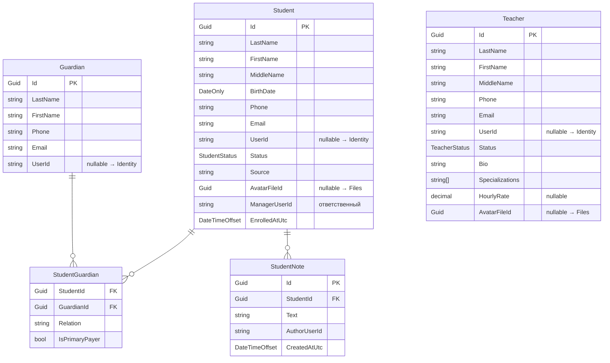

# People

← [[Edvantix]] · [[Карта модулей]] · задачи: [[Задачи · Новые модули]]

> 🟡 Проектируется · порядок `550` · схема `people`

## Назначение

Ученики, преподаватели, представители: профили, контакты, связи между ними.
Аутентификация здесь не живёт — она в [[Identity]]. Связь с учётной записью
опциональная: ученик существует и без логина.

Менеджер отдельной сущностью не моделируется — это роль пользователя
([[ADR-003 People как отдельный модуль]]).

## Домен



### Перечисления

`StudentStatus` — `Lead` `Active` `Paused` `Archived`
`TeacherStatus` — `Active` `Inactive`

### Инварианты

- `UserId` у всех трёх сущностей **nullable**. Ученик, представитель и преподаватель
  могут существовать без учётной записи.
- Возврат из `Archived` в `Active` разрешён; история зачислений сохраняется.
- У ученика произвольное число представителей; ровно один — `IsPrimaryPayer`
  (плательщик по умолчанию в [[Payments]]).
- `StudentNote` доступна только по праву `Students.ViewNotes` — преподаватель
  внутренних заметок не видит.
- Все сущности `ISoftDeletable`.
- Контакты (`Phone`, `Email`) — источник правды здесь, а не в [[Identity]];
  в Identity адрес нужен только для входа.

## Контракты

`Modules.People.Contracts`

### Команды

| Команда | Область |
|---|---|
| `CreateStudentCommand` · `UpdateStudentCommand` · `DeleteStudentCommand` | Students |
| `ArchiveStudentCommand` · `RestoreStudentCommand` | Students |
| `LinkStudentUserCommand` · `UnlinkStudentUserCommand` | Students |
| `AddStudentGuardianCommand` · `RemoveStudentGuardianCommand` · `SetPrimaryPayerCommand` | Students |
| `AddStudentNoteCommand` · `DeleteStudentNoteCommand` | Students |
| `ImportStudentsCommand` | Students |
| `CreateTeacherCommand` · `UpdateTeacherCommand` · `DeleteTeacherCommand` · `DeactivateTeacherCommand` | Teachers |
| `CreateGuardianCommand` · `UpdateGuardianCommand` · `DeleteGuardianCommand` | Guardians |

### Запросы

| Запрос | Возвращает |
|---|---|
| `SearchStudentsQuery` | `PagedList<StudentDto>` — фильтры: статус, группа, менеджер, долг |
| `GetStudentByIdQuery` | `StudentDetailDto` |
| `GetStudentGuardiansQuery` | `IReadOnlyList<GuardianDto>` |
| `GetStudentNotesQuery` | `IReadOnlyList<StudentNoteDto>` |
| `SearchTeachersQuery` · `GetTeacherByIdQuery` | `TeacherDto` |
| `GetTeacherWorkloadQuery` | `TeacherWorkloadDto` — группы и часы |
| `SearchGuardiansQuery` · `GetGuardianByIdQuery` | `GuardianDto` |
| `GetMyPeopleScopeQuery` | `PeopleScope` |

### DTO

`StudentDto` · `StudentDetailDto` · `StudentNoteDto` · `TeacherDto` ·
`TeacherWorkloadDto` · `GuardianDto` · `StudentGuardianDto` · `PeopleScope`

### Публикуемые события

| Событие | Содержимое |
|---|---|
| `StudentCreatedIntegrationEvent` | `StudentId`, ФИО |
| `StudentStatusChangedIntegrationEvent` | `StudentId`, `From`, `To` |
| `StudentArchivedIntegrationEvent` | `StudentId`, `ArchivedOn` |
| `TeacherDeactivatedIntegrationEvent` | `TeacherId` |
| `GuardianLinkedToStudentIntegrationEvent` | `GuardianId`, `StudentId`, `IsPrimaryPayer` |

### Сервисы для других модулей

```csharp
public interface IPeopleScopeResolver
{
    ValueTask<PeopleScope> ResolveAsync(string userId, CancellationToken ct = default);
}

public sealed record PeopleScope(
    Guid? StudentId,
    Guid? TeacherId,
    Guid? GuardianId,
    IReadOnlyList<Guid> WardStudentIds);
```

Отвечает на вопрос «кто этот пользователь в предметной области». Используется
[[StudyGroups]], [[Scheduling]], [[Payments]] для проверок «своих» данных.
Результат кэшируется в Redis, инвалидируется по `GuardianLinkedToStudent`
и `StudentCreated`.

```csharp
public interface IPeopleLookupService
{
    ValueTask<IReadOnlyDictionary<Guid, PersonBriefDto>> GetStudentsBriefAsync(
        IReadOnlyCollection<Guid> ids, CancellationToken ct = default);

    ValueTask<PersonBriefDto?> GetTeacherBriefAsync(Guid id, CancellationToken ct = default);
}
```

Пакетное получение ФИО для списков — иначе [[Scheduling]] и [[Payments]] упрутся в N+1.

### Подписки

Нет. People — низовой модуль, ни от кого не зависит.

## Права

Ресурсы `Students`, `Teachers`, `Guardians`.

| Ресурс | Действия |
|---|---|
| `Students` | `View` `Create` `Update` `Delete` `Export` `ViewNotes` |
| `Teachers` | `View` `Create` `Update` `Delete` |
| `Guardians` | `View` `Create` `Update` `Delete` |

`Students.ViewNotes` вынесено отдельно: внутренние заметки менеджеров не для
преподавателей. Полная раскладка — [[Модель прав доступа]].

## HTTP API

```
GET    /api/v1/students                       поиск с пагинацией
POST   /api/v1/students
GET    /api/v1/students/{id}
PUT    /api/v1/students/{id}
DELETE /api/v1/students/{id}
POST   /api/v1/students/{id}/archive
POST   /api/v1/students/{id}/restore
POST   /api/v1/students/{id}/link-user
GET    /api/v1/students/{id}/guardians
POST   /api/v1/students/{id}/guardians
DELETE /api/v1/students/{id}/guardians/{gid}
GET    /api/v1/students/{id}/notes
POST   /api/v1/students/{id}/notes
POST   /api/v1/students/import

GET    /api/v1/teachers                       + полный CRUD
GET    /api/v1/teachers/{id}/workload

GET    /api/v1/guardians                      + полный CRUD

GET    /api/v1/people/me/scope
```

## Зависимости

**Ссылается на:** `Identity.Contracts` (пользователи), `Multitenancy.Contracts`,
`Files.Contracts` (аватары).

**На него ссылаются:** [[StudyGroups]], [[Scheduling]], [[Payments]].

## Связанное

[[ADR-003 People как отдельный модуль]] · [[Глоссарий]] · [[Задачи · Новые модули]] · [[Открытые вопросы]]
