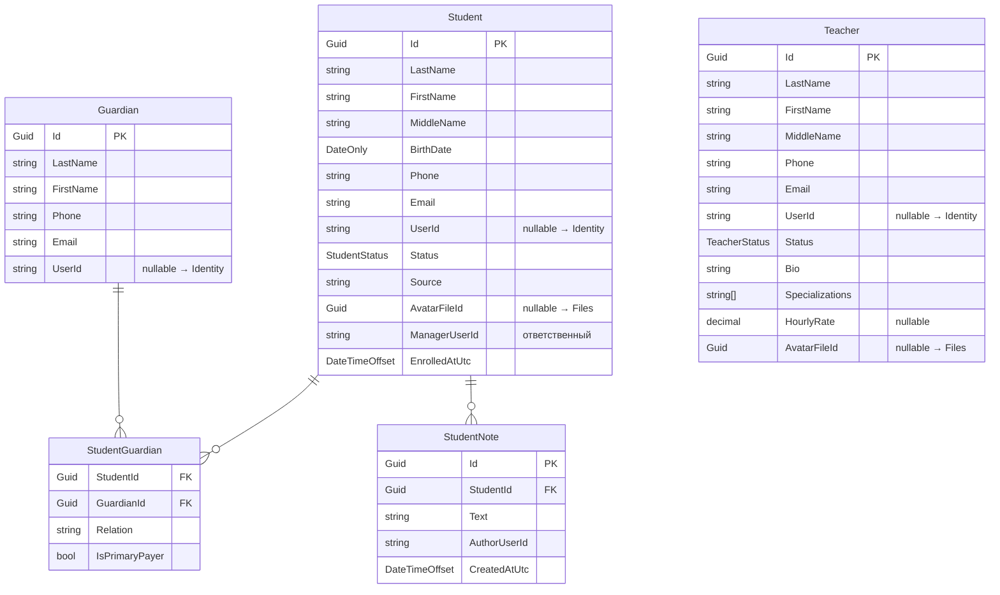

# People

← [[Edvantix]] · [[Карта модулей]] · задачи: [[Бэклог]]

> ✅ Реализован · порядок `550` · схема `people`
>
> Домен, миграция, CRUD/поиск для трёх сущностей, жизненный цикл ученика, представители,
> привязка учётной записи, заметки, `IPeopleScopeResolver`, `IPeopleLookupService`, импорт CSV —
> всё сделано, юнит- и интеграционные тесты зелёные (36 + 7).
>
> [!note] `GetTeacherWorkloadQuery` реализован — но в [[Scheduling]], не здесь
> Исходная спецификация числила его запросом People, ждущим [[StudyGroups]]. При реализации
> оказалось, что нагрузка преподавателя требует данных StudyGroups (активные группы) и
> Scheduling (сами занятия) — а People обязан оставаться низовым модулем, ничего не
> подключающим сверху. Эндпоинт `GET /teachers/{id}/workload` мапит Scheduling под чужим
> именем ресурса, тем же приёмом, что и `GET /students/{id}/attendance`. Подробности —
> `docs/02 Модули/Scheduling.md` → «Контракты».
>
> [!success] Найденный здесь вопрос по `BuildingBlocks/Eventing` — исправлен
> `AddEventingForDbContext<T>()` изначально регистрировал `IOutboxStore` без ключа — при
> двух и более модулях не-ключевой DI отдавал бы последнюю регистрацию всем. Исправлено
> при подготовке [[Scheduling]] (keyed DI по `TDbContext`, согласовано с пользователем) —
> см. `.agents/rules/eventing.md`.

## Назначение

Ученики, преподаватели, представители: профили, контакты, связи между ними.
Аутентификация здесь не живёт — она в [[Identity]]. Связь с учётной записью
опциональная: ученик существует и без логина.

Менеджер отдельной сущностью не моделируется — это роль пользователя
([[ADR-003 People как отдельный модуль]]).

## Домен



### Перечисления

`StudentStatus` — `Lead` `Active` `Paused` `Archived`
`TeacherStatus` — `Active` `Inactive`

### Инварианты

- `UserId` у всех трёх сущностей **nullable**. Ученик, представитель и преподаватель
  могут существовать без учётной записи.
- Возврат из `Archived` в `Active` разрешён; история зачислений сохраняется.
- У ученика произвольное число представителей; ровно один — `IsPrimaryPayer`
  (плательщик по умолчанию в [[Payments]]).
- `StudentNote` доступна только по праву `Students.ViewNotes` — преподаватель
  внутренних заметок не видит.
- Все сущности `ISoftDeletable`.
- Контакты (`Phone`, `Email`) — источник правды здесь, а не в [[Identity]];
  в Identity адрес нужен только для входа.

## Контракты

`Modules.People.Contracts`

### Команды

| Команда                                                                                               | Область   |
| ----------------------------------------------------------------------------------------------------- | --------- |
| `CreateStudentCommand` · `UpdateStudentCommand` · `DeleteStudentCommand`                              | Students  |
| `ArchiveStudentCommand` · `RestoreStudentCommand`                                                     | Students  |
| `LinkStudentUserCommand` · `UnlinkStudentUserCommand`                                                 | Students  |
| `AddStudentGuardianCommand` · `RemoveStudentGuardianCommand` · `SetPrimaryPayerCommand`               | Students  |
| `AddStudentNoteCommand` · `DeleteStudentNoteCommand`                                                  | Students  |
| `ImportStudentsCommand`                                                                               | Students  |
| `CreateTeacherCommand` · `UpdateTeacherCommand` · `DeleteTeacherCommand`                              | Teachers  |
| `DeactivateTeacherCommand` · `ActivateTeacherCommand`¹                                                | Teachers  |
| `LinkTeacherUserCommand` · `UnlinkTeacherUserCommand`                                                 | Teachers  |
| `CreateGuardianCommand` · `UpdateGuardianCommand` · `DeleteGuardianCommand`                           | Guardians |
| `LinkGuardianUserCommand` · `UnlinkGuardianUserCommand`                                               | Guardians |

¹ Не было в исходной спецификации — добавлено при реализации как естественная пара к
`DeactivateTeacherCommand` (`Teacher.Activate()` уже существовал в домене).

### Запросы

| Запрос                                          | Возвращает                                                        |
| ----------------------------------------------- | ----------------------------------------------------------------- |
| `SearchStudentsQuery`                           | `PagedResponse<StudentDto>` — фильтры: статус, менеджер, текст. Группа/долг — после [[StudyGroups]]/[[Payments]] |
| `GetStudentByIdQuery`                           | `StudentDetailDto`                                                |
| `GetStudentGuardiansQuery`                      | `IReadOnlyList<StudentGuardianDto>`² |
| `GetStudentNotesQuery`                          | `IReadOnlyList<StudentNoteDto>`                                   |
| `SearchTeachersQuery`                           | `PagedResponse<TeacherDto>`                                       |
| `GetTeacherByIdQuery`                           | `TeacherDto`                                                      |
| `SearchGuardiansQuery`                          | `PagedResponse<GuardianDto>`                                      |
| `GetGuardianByIdQuery`                          | `GuardianDto`                                                     |
| `GetGuardianStudentsQuery`                      | `IReadOnlyList<GuardianStudentDto>` — обратная сторона `GetStudentGuardiansQuery`: связь + `StudentDto` подопечного. Для блока «подопечные» на карточке представителя |
| `GetMyPeopleScopeQuery`                         | `PeopleScope`                                                     |

² В спецификации был `IReadOnlyList<GuardianDto>` — заменено на `StudentGuardianDto`
(обёртка над `GuardianDto` с `Relation`/`IsPrimaryPayer`) при реализации: экрану «представители
ученика» нужен не только бриф человека, но и деталь связи.

`GetTeacherWorkloadQuery`/`TeacherWorkloadDto` из исходной спецификации People — реализованы,
но в [[Scheduling]] (`GET /teachers/{id}/workload`), не здесь. См. примечание в начале файла.

### DTO

`StudentDto` · `StudentDetailDto` · `StudentNoteDto` · `TeacherDto` ·
`GuardianDto` · `StudentGuardianDto` ·
`PersonBriefDto` · `PeopleScope` · `ImportStudentsResultDto` · `ImportStudentRowResultDto`

(`TeacherWorkloadDto` lives in `Modules.Scheduling.Contracts`, not here.)

### Публикуемые события

| Событие | Содержимое |
|---|---|
| `StudentCreatedIntegrationEvent` | `StudentId`, ФИО |
| `StudentStatusChangedIntegrationEvent` | `StudentId`, `From`, `To` |
| `StudentArchivedIntegrationEvent` | `StudentId`, `ArchivedOn` |
| `TeacherDeactivatedIntegrationEvent` | `TeacherId` |
| `GuardianLinkedToStudentIntegrationEvent` | `GuardianId`, `StudentId`, `IsPrimaryPayer` |

### Сервисы для других модулей

```csharp
public interface IPeopleScopeResolver
{
    ValueTask<PeopleScope> ResolveAsync(string userId, CancellationToken ct = default);
}

public sealed record PeopleScope(
    Guid? StudentId,
    Guid? TeacherId,
    Guid? GuardianId,
    IReadOnlyList<Guid> WardStudentIds);
```

Отвечает на вопрос «кто этот пользователь в предметной области». Используется
[[StudyGroups]], [[Scheduling]], [[Payments]] для проверок «своих» данных.

Кэш — `HybridCache` (не самодельный Redis-клиент, см. `caching.md`), ключ
`people:scope:u:{userId}`, тег — переиспользуемый `CacheKeys.Tags.User(userId)` из
`BuildingBlocks/Caching` (новый тег в защищённый пакет не добавлялся). Инвалидация — в
обработчиках `AddStudentGuardianCommand`/`RemoveStudentGuardianCommand` (у затронутого
опекуна) и во всех шести `Link*User`/`Unlink*User` (у затронутого userId) — точнее набора
точек, чем изначально предполагали «по `GuardianLinkedToStudent` и `StudentCreated`».

```csharp
public interface IPeopleLookupService
{
    ValueTask<IReadOnlyDictionary<Guid, PersonBriefDto>> GetStudentsBriefAsync(
        IReadOnlyCollection<Guid> ids, CancellationToken ct = default);

    ValueTask<PersonBriefDto?> GetTeacherBriefAsync(Guid id, CancellationToken ct = default);

    // Кого уведомлять/добавлять в чат по событиям об ученике: сам ученик (UserId может быть
    // null — нет учётки) + активные опекуны с пометкой плательщика. E-mail присутствует даже
    // без учётки (Student/Guardian/Teacher хранят Email). Потребители — [[Notifications]]
    // (разлив адресатов) и [[Chat]] (участники канала группы, подстановка опекуна при
    // Student.UserId == null). Батч — все id разом, один join-запрос.
    ValueTask<IReadOnlyList<StudentContactsDto>> GetStudentContactsAsync(
        IReadOnlyCollection<Guid> studentIds, CancellationToken ct = default);

    ValueTask<ContactDto?> GetTeacherContactAsync(Guid teacherId, CancellationToken ct = default);
}
```

`GetStudentsBrief`/`GetTeacherBrief` — пакетное ФИО для списков (иначе [[Scheduling]] и
[[Payments]] упрутся в N+1). `GetStudentContacts`/`GetTeacherContact` (`ContactDto` —
`UserId?`, `Email?`, `DisplayName`, `ContactRole`) — резолв адресатов для уведомлений и
членства в чате учебной группы; тесты — `Integration.Tests/Tests/People/PeopleLookupContactsTests.cs`.

### Подписки

Нет. People — низовой модуль, ни от кого не зависит.

## Права

Ресурсы `Students`, `Teachers`, `Guardians`.

| Ресурс | Действия |
|---|---|
| `Students` | `View` `Create` `Update` `Delete` `Export` `ViewNotes` |
| `Teachers` | `View` `Create` `Update` `Delete` |
| `Guardians` | `View` `Create` `Update` `Delete` |

`Students.ViewNotes` вынесено отдельно: внутренние заметки менеджеров не для
преподавателей. Полная раскладка — [[Модель прав доступа]].

## HTTP API

```
GET    /api/v1/students                       поиск с пагинацией
POST   /api/v1/students
GET    /api/v1/students/{id}
PUT    /api/v1/students/{id}
DELETE /api/v1/students/{id}
POST   /api/v1/students/{id}/archive
POST   /api/v1/students/{id}/restore
POST   /api/v1/students/{id}/link-user
POST   /api/v1/students/{id}/unlink-user
GET    /api/v1/students/{id}/guardians
POST   /api/v1/students/{id}/guardians
DELETE /api/v1/students/{id}/guardians/{gid}
POST   /api/v1/students/{id}/guardians/{gid}/primary-payer
GET    /api/v1/students/{id}/notes
POST   /api/v1/students/{id}/notes
DELETE /api/v1/students/{id}/notes/{noteId}
POST   /api/v1/students/import                ?dryRun=true|false (по умолчанию true)

GET    /api/v1/teachers                       + полный CRUD
POST   /api/v1/teachers/{id}/deactivate
POST   /api/v1/teachers/{id}/activate
POST   /api/v1/teachers/{id}/link-user
POST   /api/v1/teachers/{id}/unlink-user
                                               (workload — mapped by Scheduling, see below)

GET    /api/v1/guardians                      + полный CRUD
GET    /api/v1/guardians/{id}/students        подопечные представителя (People.Students.View)
POST   /api/v1/guardians/{id}/link-user
POST   /api/v1/guardians/{id}/unlink-user

GET    /api/v1/people/me/scope                 единственный маршрут с сегментом /people/
```

## Зависимости

**Ссылается на:** `Identity.Contracts` (пользователи), `Multitenancy.Contracts`,
`Files.Contracts` (аватары).

**На него ссылаются:** [[StudyGroups]], [[Scheduling]], [[Payments]].

## Связанное

[[ADR-003 People как отдельный модуль]] · [[Глоссарий]] · [[Бэклог]] · [[Открытые вопросы]]
