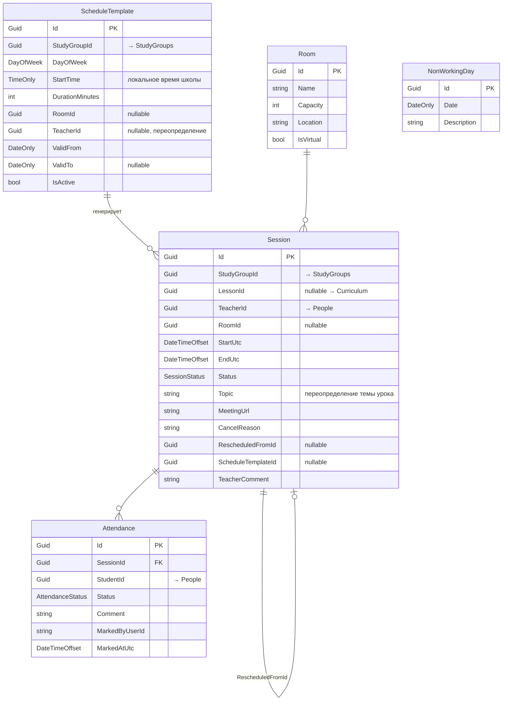
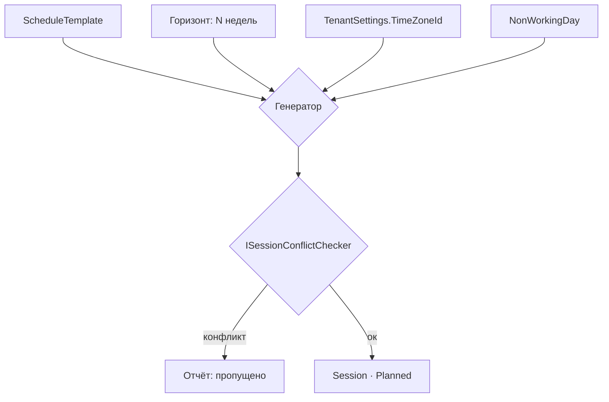

# Scheduling

← [[Edvantix]] · [[Карта модулей]] · задачи: [[Бэклог]]

> ✅ Реализован · порядок `620` · схема `scheduling`
>
> Домен (`ScheduleTemplate`/`Session`/`Attendance`/`Room`/`NonWorkingDay`, плоская
> персистентность — не вложенный агрегат, посещаемость ищется независимо от занятий),
> миграция, CRUD аудиторий/нерабочих дней/шаблонов, генератор с пересчётом через
> `TimeZoneInfo` на каждое occurrence (тест на переход на летнее время — обязателен и
> пройден), `ISessionConflictChecker` на три вида конфликтов, CRUD/жизненный цикл занятий
> (Hold/Cancel/Reschedule), массовая посещаемость, `IAttendanceQueryService`/
> `ISessionPlanQueryService` для [[Payments]], `GetTeacherWorkloadQuery` (нагрузка
> преподавателя — см. примечание в «Контракты»), 5+1 интеграционных события (пятёрка из
> этого справочника + `SessionReminderDueIntegrationEvent` под `SessionReminderJob`),
> избирательные подписки (`StudyGroupFinished`/`TeacherDeactivated` — с реальным действием;
> `StudyGroupActivated`/`StudentEnrolled`/`StudentUnenrolled` — сознательно без обработчика,
> см. «Подписки» ниже), два ежедневных/ежечасных Hangfire-задания, SignalR-трансляция.
> `Scheduling.Tests` — 39/39 (юнит), интеграционный тест изоляции тенантов — 6/6.
> Ретроспектива этапа и рисков — [[Этапы внедрения]] → «Этап 4 · Scheduling».
> Frontend реализован (PR #19).

## Назначение

Расписание занятий и посещаемость. Шаблон повторения → сгенерированные занятия →
отметки присутствия. Самый сложный из новых модулей: часовые пояса, повторяемость,
конфликты ресурсов.

## Домен



### Перечисления

`SessionStatus` — `Planned` `Held` `Cancelled` `Rescheduled`
`AttendanceStatus` — `Present` `Absent` `Late` `Excused`

### Инварианты

- `EndUtc > StartUtc`; занятие принадлежит ровно одной группе.
- `LessonId` **опционален**: консультация, отработка, пробное занятие программе не
  соответствуют ([[ADR-006 Урок программы и занятие расписания]]).
- `Topic` пусто → тема берётся из `Lesson.Title`.
- Записи `Attendance` создаются при переводе занятия в `Held`, по списку активных
  на дату учеников (`IStudyGroupQueryService.GetActiveStudentIdsAsync`) — не при
  создании занятия: состав группы к тому моменту ещё изменится.
- Уникальный индекс `(ScheduleTemplateId, StartUtc)` — повторный прогон генератора
  не создаёт дублей.
- Отменённое занятие не порождает начислений в [[Payments]].
- Посещаемость по занятию, вошедшему в выставленный счёт, меняется только по праву
  `Attendance.MarkAny`.

### Время

> [!danger] Хранится UTC, считается в часовом поясе школы
> `StartUtc` / `EndUtc` — `DateTimeOffset` в UTC. часовой пояс школы (`TenantSettings.TimeZoneId`, IANA)
> применяется при **генерации** занятий из шаблона и при **отображении**.
>
> Шаблон «каждый вторник в 18:00» после перехода на летнее время должен остаться
> в 18:00 по местному — значит UTC-момент сдвигается. Генератор пересчитывает через
> `TimeZoneInfo`, а не прибавляет 7 дней к UTC.
>
> `ScheduleTemplate.StartTime` — локальное время, `Session.StartUtc` — UTC.
> Это единственное место в системе, где локальное время хранится в БД.

### Генерация



Периодическое задание Hangfire держит горизонт; ручной запуск — по праву
`Sessions.Generate`. Перед применением доступен предпросмотр.

### Конфликты

`ISessionConflictChecker` проверяет три пересечения:

| Ресурс | Правило |
|---|---|
| Преподаватель | не ведёт два занятия одновременно |
| Аудитория | одно занятие за раз; только при `IsVirtual = false` |
| Группа | у группы нет двух занятий одновременно |

При генерации конфликт → занятие пропускается и попадает в отчёт.
При ручном создании → `409 Conflict` с описанием. Флаг `force: true` разрешает
принудительно (подмена преподавателя иногда легальна).

## Контракты

`Modules.Scheduling.Contracts`

### Команды

| Команда | Область |
|---|---|
| `CreateSessionCommand` · `UpdateSessionCommand` | Sessions |
| `HoldSessionCommand` | Sessions — создаёт записи посещаемости |
| `CancelSessionCommand` · `RescheduleSessionCommand` | Sessions |
| `CreateScheduleTemplateCommand` · `UpdateScheduleTemplateCommand` · `DeleteScheduleTemplateCommand` | Templates |
| `GenerateSessionsCommand` | Templates |
| `MarkAttendanceCommand` | Attendance — массовая отметка по занятию |
| `CreateRoomCommand` · `UpdateRoomCommand` · `DeleteRoomCommand` | Rooms |
| `AddNonWorkingDayCommand` · `RemoveNonWorkingDayCommand` | Calendar |

### Запросы

| Запрос | Возвращает |
|---|---|
| `SearchSessionsQuery` | диапазон дат, группа, преподаватель, аудитория |
| `GetSessionByIdQuery` | `SessionDetailDto` — с материалами урока и посещаемостью |
| `GetMyScheduleQuery` | своё расписание по роли |
| `GetCalendarQuery` | агрегированный вид для календаря |
| `PreviewGenerationQuery` | что будет создано + конфликты, без записи |
| `GetSessionAttendanceQuery` | `IReadOnlyList<AttendanceDto>` |
| `GetStudentAttendanceQuery` | история ученика |
| `GetGroupAttendanceReportQuery` | сводка по группе за период |
| `GetScheduleTemplatesQuery` · `GetRoomsQuery` · `GetNonWorkingDaysQuery` | справочники |
| `GetTeacherWorkloadQuery` | `TeacherWorkloadDto` — см. примечание ниже |

> [!note] `GetTeacherWorkloadQuery` живёт здесь, а не в [[People]]
> Изначально спецификация числила его запросом People (`GET /teachers/{id}/workload`,
> `TeacherWorkloadDto` в её списке DTO) — но People обязан оставаться низовым модулем
> (порядок `550`, ни на что не подписывается), а нагрузка преподавателя требует и
> активных групп ([[StudyGroups]], `IStudyGroupQueryService.GetActiveGroupIdsForTeacherAsync`
> — аддитивное расширение контракта), и собственных `Session` этого модуля. Тот же приём,
> что уже применён для `GET /students/{id}/attendance`: Scheduling мапит эндпоинт под чужим
> именем ресурса (`/teachers/`), гейтит своим правом (`Sessions.View`), не People. Если
> `From`/`To` не заданы — по умолчанию «сегодня + 7 дней», короче 8-недельного горизонта
> генерации (`SchedulingDefaults.DefaultWorkloadWindowDays`).

### DTO

`SessionDto` · `SessionDetailDto` · `CalendarEntryDto` · `AttendanceDto` ·
`AttendanceReportDto` · `ScheduleTemplateDto` · `GenerationPreviewDto` ·
`SessionConflictDto` · `RoomDto` · `NonWorkingDayDto` · `TeacherWorkloadDto`

### Публикуемые события

| Событие | Содержимое |
|---|---|
| `SessionScheduledIntegrationEvent` | `SessionId`, `StudyGroupId`, `StartUtc` |
| `SessionCancelledIntegrationEvent` | `SessionId`, `StudyGroupId`, `Reason` |
| `SessionRescheduledIntegrationEvent` | `SessionId`, `NewSessionId`, `StudyGroupId`, `OldStartUtc`, `NewStartUtc` |
| `SessionHeldIntegrationEvent` | `SessionId`, `StudyGroupId`, `LessonId?`, `HeldAtUtc` |
| `AttendanceMarkedIntegrationEvent` | `SessionId`, `StudentId`, `Status` |
| `SessionReminderDueIntegrationEvent` | `SessionId`, `StudyGroupId`, `StartUtc` — публикуется `SessionReminderJob`, не событие жизненного цикла занятия, см. «Задания Hangfire» ниже |

`StudyGroupId` в `SessionRescheduledIntegrationEvent` добавлен аддитивно для подписчика
[[Notifications]] — `oldSession.StudyGroupId` уже был у издателя.

### Сервисы для других модулей

```csharp
public interface IAttendanceQueryService
{
    ValueTask<int> CountHeldSessionsAsync(
        Guid studentId, Guid studyGroupId, DateOnly from, DateOnly to,
        CancellationToken ct = default);

    ValueTask<AttendanceBreakdown> GetBreakdownAsync(
        Guid studentId, Guid studyGroupId, DateOnly from, DateOnly to,
        CancellationToken ct = default);
}

public interface ISessionPlanQueryService
{
    ValueTask<int> CountPlannedSessionsAsync(
        Guid studyGroupId, DateOnly from, DateOnly to, CancellationToken ct = default);
}
```

Первый — основа потарифного начисления, второй — пропорционального расчёта
помесячного тарифа в [[Payments]].

### Подписки

| Событие | Реакция | Реализовано как |
|---|---|---|
| `StudyGroupActivatedIntegrationEvent` | разрешить генерацию | синхронная проверка `group.Status == Active` в `GenerateSessionsCommandHandler` — без обработчика, нечего кэшировать |
| `StudyGroupFinishedIntegrationEvent` | остановить генерацию | `StudyGroupFinishedIntegrationEventHandler` деактивирует все `ScheduleTemplate` группы |
| `StudentEnrolledIntegrationEvent` | учесть в будущих занятиях | без обработчика — состав для `Attendance` считается на момент `Hold`, не на момент зачисления (сам инвариант ниже это и обеспечивает) |
| `StudentUnenrolledIntegrationEvent` | снять с будущих занятий | без обработчика, по той же причине |
| `TeacherDeactivatedIntegrationEvent` (People) | пометить занятия без преподавателя | `TeacherDeactivatedIntegrationEventHandler` помечает будущие `Planned`-занятия через `Session.TeacherComment` |

> [!note] Три из пяти — без отдельного обработчика, сознательно
> Не пробел в реализации: `StudyGroupActivated`/`StudentEnrolled`/`StudentUnenrolled` не
> оставляют состояния, которое нужно было бы согласовывать асинхронно — соответствующая
> проверка либо пересчитывается на каждый вызов (генерация), либо вообще не хранится
> (посещаемость считается с нуля в момент `Hold`).

### Реальное время

Изменения расписания транслируются в dashboard через SignalR: у преподавателя открыт
календарь, менеджер переносит занятие — обновление без перезагрузки.

> [!note] Реализация — `ISessionRealtimeNotifier`
> Событие `SessionScheduleChanged` в группу `tenant:{id}`, payload `SessionDto`. Подключено к
> `CreateSession`/`UpdateSession`/`CancelSession`/`RescheduleSession` (два broadcast — старое
> занятие переходит в `Rescheduled` на месте, новое появляется на новом слоте)/`HoldSession`.
> **Не** подключено к генерации (ручной и фоновой) — десятки/сотни занятий разом, точечные
> broadcast-события не подходят; инкрементальная синхронизация календаря при массовой
> генерации осталась бы отдельной задачей фронтенда. Не подключено и к `MarkAttendance` —
> посещаемость не двигает карточки на календаре.

## Права

| Ресурс | Действия |
|---|---|
| `Sessions` | `View` `ViewOwn` `Create` `Update` `Cancel` `Reschedule` `Generate` |
| `Attendance` | `View` `ViewOwn` `Mark` `MarkAny` |
| `Rooms` | `View` `Manage` |
| `ScheduleTemplates` | `View` `Manage` |

`Sessions.Generate` отделено от `Create`: затрагивает сотни записей.
`Attendance.MarkAny` — правка задним числом после закрытия периода.

> [!note] `Attendance.MarkAny` зарегистрировано, но не проверяется
> Нечего сверять: [[Payments]] не реализован, поэтому «занятие вошло в выставленный счёт» —
> вопрос без ответа на этой стадии. Единственное право на `PUT /sessions/{id}/attendance`
> сейчас — `Attendance.Mark`. Добавить row-level проверку `MarkAny` — задача при реализации
> Payments. `Sessions.Hold` не отдельное право — гейтится `Sessions.Update` (в этом справочнике
> не заведено собственное действие `Hold`). Нерабочие дни (`NonWorkingDay`) гейтятся
> `ScheduleTemplates.View`/`.Manage` — отдельного ресурса под календарь не заводили.

## HTTP API

```
GET    /api/v1/sessions
GET    /api/v1/sessions/my
GET    /api/v1/sessions/calendar
POST   /api/v1/sessions
GET    /api/v1/sessions/{id}
PUT    /api/v1/sessions/{id}
POST   /api/v1/sessions/{id}/hold
POST   /api/v1/sessions/{id}/cancel
POST   /api/v1/sessions/{id}/reschedule

GET    /api/v1/study-groups/{id}/schedule-templates
POST   /api/v1/study-groups/{id}/schedule-templates
PUT    /api/v1/schedule-templates/{id}
DELETE /api/v1/schedule-templates/{id}
POST   /api/v1/schedule-templates/{id}/preview
POST   /api/v1/schedule-templates/{id}/generate

GET    /api/v1/sessions/{id}/attendance
PUT    /api/v1/sessions/{id}/attendance
GET    /api/v1/students/{id}/attendance
GET    /api/v1/study-groups/{id}/attendance-report

GET    /api/v1/rooms                            + CRUD
GET    /api/v1/non-working-days                 + CRUD

GET    /api/v1/teachers/{id}/workload           ?from=&to= — см. примечание в «Контракты»
```

## Задания Hangfire

| Задание | Расписание | Что делает |
|---|---|---|
| `GenerateSessionsJob` | ежедневно, 02:00 UTC | держит горизонт занятий в N недель — обходит все тенанты, на каждый активный `ScheduleTemplate` зовёт `GenerateSessionsCommand` через `IMediator` |
| `SessionReminderJob` | ежечасно | окно `[+23ч, +24ч)` от текущего момента — естественная идемпотентность без флага «уже напомнили»; публикует `SessionReminderDueIntegrationEvent`, саму отправку берёт [[Notifications]] (не реализован в этой сессии) |

Оба задания создают отдельный DI-scope на каждый тенант и устанавливают Finbuckle-контекст
до обращения к `SchedulingDbContext` — фоновая задача не имеет ambient tenant-контекста
(см. `.agents/rules/jobs.md`).

## Зависимости

**Ссылается на:** `StudyGroups.Contracts`, `People.Contracts`, `Curriculum.Contracts`,
`Identity.Contracts`, `Multitenancy.Contracts` (`ITenantSettingsService` — часовой пояс).

**На него ссылаются:** [[Payments]].
**Подписаны на его события:** [[Notifications]], [[Payments]], [[Webhooks]].

## Связанное

[[ADR-006 Урок программы и занятие расписания]] · [[StudyGroups]] · [[Payments]] · [[Бэклог]] · [[Открытые вопросы]]
