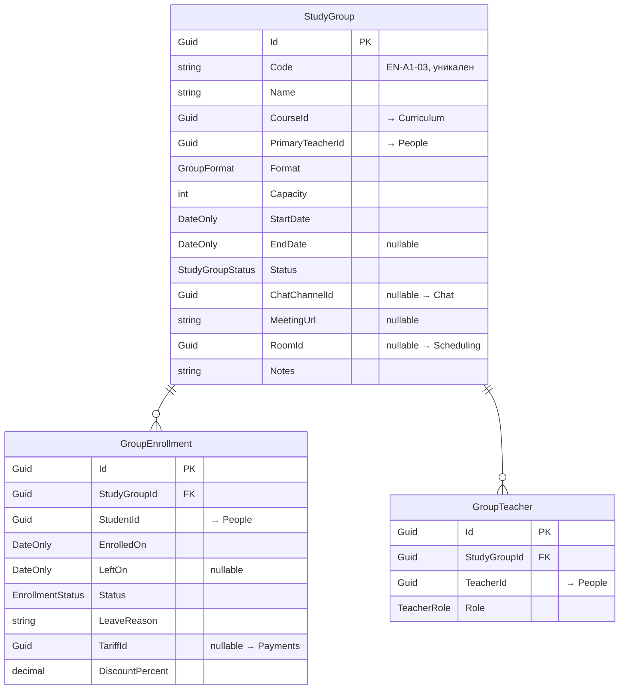

# StudyGroups

← [[Edvantix]] · [[Карта модулей]] · задачи: [[Задачи · Новые модули]]

> ✅ Реализован · порядок `610` · схема `study_groups`
>
> Домен (`StudyGroup`/`GroupEnrollment`/`GroupTeacher` как вложенный агрегат), миграция,
> CRUD/поиск/жизненный цикл групп, зачисление/отчисление/перевод/пауза-возобновление,
> ростер преподавателей, `IStudyGroupQueryService`, пять интеграционных событий и три подписки
> на People/Curriculum — всё сделано. `dotnet build` — 0 предупреждений/0 ошибок,
> `StudyGroups.Tests` (юнит) — 32/32, `StudyGroupsTenantIsolationTests` (интеграционные) — 2/2,
> полный прогон `Integration.Tests` — 746/747 (1 skip, не связан со StudyGroups), без регрессий.
> Подробный статус по шагам — [[Задачи · Новые модули]] → раздел StudyGroups. Frontend не начат —
> см. [[Задачи · Frontend]] → «Этап 3 · StudyGroups».

## Назначение

Учебная группа связывает курс ([[Curriculum]]), преподавателя и учеников ([[People]])
на заданный период. На эту связь опираются расписание и все начисления.

Сущность называется `StudyGroup`, а не `Group`: последнее занято группой доступа
в [[Identity]] — [[ADR-005 Именование Group и StudyGroup]].

## Домен



### Перечисления

`GroupFormat` — `Online` `Offline` `Hybrid`
`StudyGroupStatus` — `Forming` `Active` `Finished` `Cancelled`
`EnrollmentStatus` — `Active` `Paused` `Left` `Completed`
`TeacherRole` — `Primary` `Assistant` `Substitute`

### Инварианты

- Число активных зачислений ≤ `Capacity`; превышение — ошибка валидации.
- Курс должен быть `Published` (проверка через `ICourseQueryService`).
- Один ученик — одно активное зачисление в конкретную группу. Повторное после `Left`
  допустимо: создаётся новая запись, старая сохраняется.
- Переход в `Active` требует хотя бы одного зачисления и шаблона расписания.
- `Finished` замораживает состав: изменения запрещены, просмотр открыт.
- `Code` уникален в пределах тенанта.

> [!important] Зачисление — историческая запись
> При отчислении `GroupEnrollment` не удаляется: проставляется `LeftOn` и
> `Status = Left`. Иначе развалятся посещаемость за прошлые месяцы и выставленные
> счета. Мягкое удаление — только для ошибочно созданных записей.

`EnrolledOn` — дата фактического начала. Влияет на [[Scheduling]] (в занятия до этой
даты ученик не попадает) и на [[Payments]] (начисление с даты зачисления,
при помесячном тарифе — пропорционально).

## Контракты

`Modules.StudyGroups.Contracts`

### Команды

| Команда | Область |
|---|---|
| `CreateStudyGroupCommand` · `UpdateStudyGroupCommand` · `DeleteStudyGroupCommand` | Groups |
| `ActivateStudyGroupCommand` · `FinishStudyGroupCommand` · `CancelStudyGroupCommand` | Groups |
| `EnrollStudentsCommand` | Enrollments — принимает список |
| `UnenrollStudentCommand` | Enrollments — с причиной |
| `TransferEnrollmentCommand` | Enrollments — атомарный перевод между группами |
| `PauseEnrollmentCommand` · `ResumeEnrollmentCommand` | Enrollments |
| `AddGroupTeacherCommand` · `RemoveGroupTeacherCommand` | Teachers |

### Запросы

| Запрос | Возвращает |
|---|---|
| `SearchStudyGroupsQuery` | `PagedList<StudyGroupDto>` — курс, преподаватель, статус, формат |
| `GetStudyGroupByIdQuery` | `StudyGroupDetailDto` — состав и преподаватели |
| `GetMyStudyGroupsQuery` | свои: преподаватель или ученик |
| `GetGroupEnrollmentsQuery` | `IReadOnlyList<GroupEnrollmentDto>` |
| `GetStudentEnrollmentsQuery` | все группы ученика, включая завершённые |

### DTO

`StudyGroupDto` · `StudyGroupDetailDto` · `GroupEnrollmentDto` · `GroupTeacherDto`

### Публикуемые события

| Событие | Содержимое |
|---|---|
| `StudyGroupCreatedIntegrationEvent` | `StudyGroupId`, `Name`, `CourseId`, `PrimaryTeacherId` |
| `StudyGroupActivatedIntegrationEvent` | `StudyGroupId` |
| `StudyGroupFinishedIntegrationEvent` | `StudyGroupId`, `FinishedOn` |
| `StudentEnrolledIntegrationEvent` | `StudyGroupId`, `StudentId`, `EnrolledOn`, `TariffId?` |
| `StudentUnenrolledIntegrationEvent` | `StudyGroupId`, `StudentId`, `LeftOn`, `Reason` |

### Сервисы для других модулей

```csharp
public interface IStudyGroupQueryService
{
    ValueTask<IReadOnlyList<Guid>> GetActiveStudentIdsAsync(
        Guid studyGroupId, DateOnly onDate, CancellationToken ct = default);

    ValueTask<bool> IsStudentActiveInGroupAsync(
        Guid studentId, Guid studyGroupId, DateOnly onDate, CancellationToken ct = default);

    ValueTask<StudyGroupBriefDto?> GetBriefAsync(
        Guid studyGroupId, CancellationToken ct = default);
}
```

`GetActiveStudentIdsAsync` — [[Scheduling]] использует при создании списка посещаемости
на дату; [[Payments]] — при расчёте начислений. Синхронный вызов, потому что нужен
ответ, а не реакция.

### Подписки

| Событие | Реакция |
|---|---|
| `StudentArchivedIntegrationEvent` (People) | закрыть активные зачисления |
| `TeacherDeactivatedIntegrationEvent` (People) | пометить группы без преподавателя |
| `CourseArchivedIntegrationEvent` (Curriculum) | запретить новые группы по курсу |

## Права

| Ресурс | Действия |
|---|---|
| `StudyGroups` | `View` `ViewOwn` `Create` `Update` `Delete` `Archive` |
| `Enrollments` | `View` `Create` `Delete` `Transfer` |

`ViewOwn` — преподаватель видит свои группы, ученик те, где состоит; принадлежность
проверяется в обработчике через `IPeopleScopeResolver`.
`Enrollments.Transfer` отдельно: перевод затрагивает деньги.

## HTTP API

```
GET    /api/v1/study-groups
POST   /api/v1/study-groups
GET    /api/v1/study-groups/{id}
PUT    /api/v1/study-groups/{id}
DELETE /api/v1/study-groups/{id}
POST   /api/v1/study-groups/{id}/activate
POST   /api/v1/study-groups/{id}/finish
POST   /api/v1/study-groups/{id}/cancel
GET    /api/v1/study-groups/my

GET    /api/v1/study-groups/{id}/enrollments
POST   /api/v1/study-groups/{id}/enrollments
DELETE /api/v1/study-groups/{id}/enrollments/{eid}
POST   /api/v1/enrollments/{eid}/transfer

POST   /api/v1/study-groups/{id}/teachers
DELETE /api/v1/study-groups/{id}/teachers/{tid}

GET    /api/v1/students/{id}/enrollments
```

## Зависимости

**Ссылается на:** `People.Contracts`, `Curriculum.Contracts`, `Identity.Contracts`,
`Multitenancy.Contracts`.

**На него ссылаются:** [[Scheduling]], [[Payments]].
**Подписаны на его события:** [[Chat]] (канал группы), [[Notifications]], [[Webhooks]].

## Связанное

[[ADR-005 Именование Group и StudyGroup]] · [[Scheduling]] · [[Payments]] · [[Задачи · Новые модули]]
