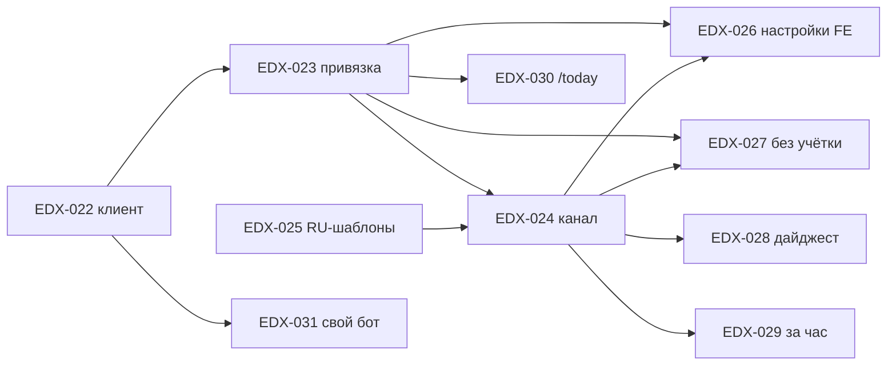

# EDX-021 · Telegram-уведомления (зонтик)

## Контекст

Пункт 1.2 [[Дорожная карта развития|дорожной карты]]: родители не читают почту,
а колокольчик в приложении видят только те, кто в него заходит. Telegram — канал,
куда родитель реально смотрит. В модуле [[Notifications]] точка расширения уже есть:
`INotificationChannel` + бит в `NotificationChannelKind`, диспетчер разливает одно
отрендеренное уведомление по каналам. Не хватает самого канала, привязки чата к
получателю и интерфейса.

Эта задача — зонтик: продуктовые решения ниже обязательны для всех дочерних задач.
Код в ней не пишется; закрывается, когда закрыты EDX-022…EDX-027 (p1). EDX-028…EDX-031 —
улучшения, зонтик их не ждёт.

## Принятые решения

| # | Решение | Почему |
|---|---|---|
| 1 | **Один бот платформы** (`@EdvantixBot`), токен — в конфигурации хоста, не в БД | школа ничего не настраивает; секретов в БД нет, шифрование в `BuildingBlocks` не требуется. Свой бот школы — [[EDX-031 Собственный бот школы]], позже |
| 2 | **Привязка только по deep-link** `https://t.me/<bot>?start=<token>` | никакого поиска по телефону: телефон родителя может совпадать в нескольких школах и у нескольких детей, а бот один на всех. Токен однозначно говорит «какая школа, какой получатель» |
| 3 | **Токен привязки — на получателя**, 32 случайных байта Base64Url, срок 30 дней, аннулируется при привязке или при выпуске нового | одна и та же ссылка работает и на экране, и в письме, и в сообщении от менеджера; не нужно двух видов токенов |
| 4 | **Получатель = `RecipientKey`**: `UserId` для учётки, `email:{addr}` для человека без учётки — ровно то, что уже идёт в `NotificationRequest.RecipientUserId` | канал ищет чат по тому же ключу, которым диспетчер уже адресует, — `SchoolNotificationFanout` не меняется. Известное ограничение: смена e-mail у человека без учётки рвёт привязку — менеджер выдаёт новую ссылку |
| 5 | **Ссылку выдаёт**: пользователь с учёткой — сам на `/settings/notifications`; человеку без учётки — менеджер с карточки в People, плюс автоматически в футере каждого письма-уведомления | у большинства родителей учётки нет — без менеджерского пути канал не взлетит |
| 6 | **Приём обновлений**: вебхук в проде (`POST /api/v1/telegram/webhook`, анонимный, проверка `X-Telegram-Bot-Api-Secret-Token`), long polling — режим для локальной разработки | вебхук — рекомендация Telegram и не держит соединение; polling нужен, потому что локалхост снаружи не виден |
| 7 | **Свой тонкий клиент** на `IHttpClientFactory` + `AddHeroResilience`, без NuGet `Telegram.Bot` | нужно пять методов (`getMe`, `setWebhook`, `deleteWebhook`, `getUpdates`, `sendMessage`); своя модель ответа и своя обработка `429 retry_after` |
| 8 | **Отправка через Hangfire** (`SendTelegramMessageJob`, `[AutomaticRetry(3)]`), канал best-effort как e-mail | in-memory шина гоняет обработчики синхронно в запросе издателя; ждать Telegram в `HoldSession` нельзя |
| 9 | **Формат сообщения**: `parse_mode=HTML`, `<b>Заголовок</b>` + тело, одна inline-кнопка «Открыть» с абсолютной ссылкой на дашборд | короткие, одинаковые, с одним действием. Отдельных Telegram-шаблонов нет — рендерятся `TitleTemplate`/`BodyTemplate`/`LinkTemplate` |
| 10 | **Дефолты подписок для Telegram**: включены четыре high-signal типа (отмена, перенос, счёт, просрочка) **плюс напоминание о занятии** | напоминание — главная ценность мессенджера; в почте оно осталось opt-in |
| 11 | **Тихие часы** действуют на Telegram как на e-mail; **дайджест** — [[EDX-028 Дайджест для Telegram]], в первой версии сообщения идут по одному | пачечные типы редки; дайджест не блокирует запуск |
| 12 | **Отвязка**: кнопка в настройках, команда `/stop`, блокировка бота (`403 bot was blocked`) → привязка помечается неактивной, UI показывает «отключено» | сообщения в заблокированный чат — мусор в логах и лишние ретраи |
| 13 | **Язык сообщений — русский** ([[EDX-025 Русские шаблоны уведомлений]]) | дашборд полностью на русском, шаблоны сейчас на английском — первое сообщение родителю не должно быть на английском |
| 14 | **PII в логах не пишем**: ни chat-id, ни username, ни телефон | правило уже действует для e-mail-канала |

## Что сделать

- [ ] [[EDX-022 Клиент бота и приём обновлений Telegram]] — `TelegramOptions`, клиент, вебхук/polling, регистрация вебхука, health
- [ ] [[EDX-023 Привязка получателя к Telegram]] — `TelegramLink`, токен, `/start`, `/stop`, эндпоинты
- [ ] [[EDX-024 Канал доставки Telegram]] — бит `Telegram`, канал, job, настройки подписок
- [ ] [[EDX-025 Русские шаблоны уведомлений]]
- [ ] [[EDX-026 Блок Telegram в настройках уведомлений]] — dashboard
- [ ] [[EDX-027 Подключение Telegram для людей без учётной записи]] — карточки People + футер писем
- [ ] Улучшения после запуска: [[EDX-028 Дайджест для Telegram]], [[EDX-029 Напоминание за час до занятия]], [[EDX-030 Команды бота today и tomorrow]], [[EDX-031 Собственный бот школы]]

## Порядок

EDX-022 и EDX-025 независимы — можно вести параллельно.

## Ручная подготовка (ops)

- Создать бота в `@BotFather`: имя «Edvantix», username `EdvantixBot` (или свободный
  вариант), описание, аватар. Отключить группы (`/setjoingroups` → Disable), включить
  `/setprivacy` → Enable.
- Секреты: `TelegramOptions__BotToken`, `TelegramOptions__WebhookSecret` в `deploy/`
  (dokploy) и параметром Aspire для локального стенда. В git не попадают.

## Проверка (сквозной сценарий)

1. Менеджер на карточке представителя без учётки нажимает «Ссылка для подключения», отправляет её родителю.
2. Родитель открывает ссылку, жмёт «Start» — бот отвечает «Вы подключены к школе «…»».
3. Менеджер отменяет занятие — родителю в Telegram приходит «Занятие отменено», с кнопкой «Открыть».
4. Родитель пишет `/stop` — привязка снята, следующая отмена в Telegram не приходит, письмо приходит.
5. Пользователь с учёткой на `/settings/notifications` подключает Telegram по QR, выключает тумблер «Счёт выставлен → Telegram» — счёт приходит только в приложение и на почту.

## Связанное

[[Дорожная карта развития]] · [[Notifications]] · [[People]] · `.agents/rules/modules/notifications.md`
