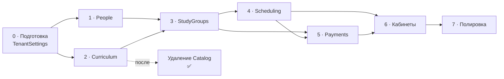

# Этапы внедрения

← [[Бэклог]]

Порядок и риски. Сами задачи — в [[Задачи · Новые модули]],
[[Задачи · Доработки каркаса]], [[Задачи · Frontend]],
[[Задачи · Удаление Catalog]]; здесь они не дублируются.

Порядок продиктован зависимостями модулей ([[Карта модулей]]), а не удобством.

## Критический путь

`People` и `Curriculum` независимы — можно вести параллельно.
`Payments` зависит от `Scheduling` только в части потарифного начисления:
помесячные тарифы делаются раньше.

> [!success] Этапы 0–7 реализованы полностью
> Backend и frontend всех этапов слиты в `main` (PR #1–#24), включая удаление Catalog.
> Таблица и разбор рисков ниже оставлены как ретроспектива для будущих модулей.
> Открытые пункты (доки для интеграторов, публичный docs-репозиторий, ручной `DROP SCHEMA`
> на проде) — в [[Бэклог]].

## Этапы

| Этап | Цель | Статус | Задачи | Риски |
|---|---|---|---|---|
| **0 · Подготовка** | база под предметные модули | ✅ готово | [[Задачи · Доработки каркаса]] → Multitenancy, Identity | `TimeZoneId` блокировал этап 4; `AppTenantInfo` трогать нельзя |
| **1 · People** | в системе есть люди | ✅ готово | [[Задачи · Новые модули]] → People | `IPeopleScopeResolver` покрыл сценарии этапов 3–5 (подтверждено кодом) |
| **2 · Curriculum** | программа описана | ✅ готово | → Curriculum | паттерны копируются из Catalog **до** его удаления |
| **— · Удаление Catalog** | демо-модуль убран | ✅ готово | [[Задачи · Удаление Catalog]] | только после того, как Curriculum покрыт тестами; отдельным PR |
| **3 · StudyGroups** | ученики распределены | ✅ готово | → StudyGroups | зачисление — историческая запись, не текущее состояние |
| **4 · Scheduling** | расписание живёт | ✅ готово | → Scheduling | часовые пояса, повторяемость, конфликты — покрыты тестами |
| **5 · Payments** | деньги учтены | ✅ готово | → Payments | арифметика и идемпотентность покрыты тестами; остаток пакета `PerPackage` закрыт в PR #9 |
| **6 · Кабинеты** | ученики заходят сами | ✅ готово | Frontend + Notifications, Chat, Tickets, Identity | перегрузить уведомлениями легко |
| **7 · Полировка** | продукт готов | ✅ готово | Webhooks, Auditing, Billing, терминология, демо-данные | — |

## Где был сосредоточен риск

### Этап 0 — обманчиво мелкий

Часовой пояс выглядел как одно поле. Не заведи его тогда — генератор расписания
на этапе 4 был бы написан на UTC-арифметике и сломался бы на первом же переходе
на летнее время.

Ловушка: очевидное место для поля — `AppTenantInfo` — лежит в защищённом
`src/BuildingBlocks`. Решение — сущность `TenantSettings` внутри модуля
[[Multitenancy]], по образцу `TenantTheme`. Подробно — [[Задачи · Доработки каркаса]].

### Этап 4 — три источника трудноуловимых багов

Часовые пояса, повторяемость, конфликты ресурсов. `Scheduling.Tests` включает
обязательный тест на переход на летнее время (America/New_York) — писался **до**
остальной реализации генератора, не после. Библиотеку календаря для фронтенда
всё ещё нужно выбрать до старта его этапа ([[Открытые вопросы]]).

### Этап 5 — цена ошибки максимальна

Неверная арифметика в счетах обнаружилась бы не тестами, а конфликтом с родителем.
Покрытие: суммы строк, частичные оплаты, сторно, переплата, пропорциональные
начисления, округление — `Payments.Tests` (34/34).

Идемпотентность подписок (повторная доставка `SessionHeld` и т.п. не начисляет
дважды) реализована и покрыта тестами.

### Удаление Catalog — вопрос момента, а не сложности

Удалить легко. Опасно удалить **рано**: Catalog — единственный полный пример
конвенций проекта в кодовой базе. [[Curriculum]] уже готов и покрыт тестами, так
что момент настал — backend удалён 2026-08-27 ([[Задачи · Удаление Catalog]]); frontend
ещё открыт.

## Определение готовности этапа

Полный чек-лист — в [[Бэклог]]. Кратко: сборка без предупреждений,
`Architecture.Tests` зелёные, тест изоляции тенантов на каждую сущность,
Playwright на сценарии этапа, правила для ИИ-инструментов, обновлённый справочник
модуля, публичная документация и changelog.

## Связанное

[[Бэклог]] · [[Задачи · Новые модули]] · [[Задачи · Доработки каркаса]] · [[Задачи · Frontend]] · [[Открытые вопросы]]
