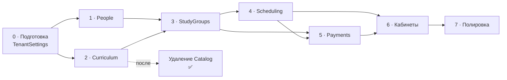

# Этапы внедрения

← [[Бэклог]]

Ретроспектива по этапам 0–7 и рискам. Текущие работы — в [[Бэклог|Бэклоге]]
(`EDX-NNN`), здесь не дублируются.

Порядок был продиктован зависимостями модулей ([[Карта модулей]]), а не удобством.

## Критический путь

`People` и `Curriculum` независимы — велись параллельно.
`Payments` зависит от `Scheduling` только в части потарифного начисления.

> [!success] Этапы 0–7 реализованы полностью
> Backend и frontend всех этапов слиты в `main` (PR #1–#31), включая удаление Catalog.
> Таблица и разбор рисков ниже оставлены как ретроспектива для будущих модулей.
> Оставшиеся хвосты — в [[Бэклог|Бэклоге]] как задачи `EDX-NNN`.

## Этапы

| Этап | Цель | Статус | Риски (как проявились) |
|---|---|---|---|
| **0 · Подготовка** | база под предметные модули | ✅ готово | `TimeZoneId` блокировал этап 4; `AppTenantInfo` трогать нельзя |
| **1 · People** | в системе есть люди | ✅ готово | `IPeopleScopeResolver` покрыл сценарии этапов 3–5 (подтверждено кодом) |
| **2 · Curriculum** | программа описана | ✅ готово | паттерны копировались из Catalog **до** его удаления |
| **— · Удаление Catalog** | демо-модуль убран | ✅ готово (осталось [[EDX-017 DROP SCHEMA catalog на проде]]) | только после того, как Curriculum покрыт тестами; отдельным PR |
| **3 · StudyGroups** | ученики распределены | ✅ готово | зачисление — историческая запись, не текущее состояние |
| **4 · Scheduling** | расписание живёт | ✅ готово | часовые пояса, повторяемость, конфликты — покрыты тестами |
| **5 · Payments** | деньги учтены | ✅ готово | арифметика и идемпотентность покрыты тестами; остаток пакета `PerPackage` закрыт в PR #9 |
| **6 · Кабинеты** | ученики заходят сами | ✅ готово | перегрузить уведомлениями легко |
| **7 · Полировка** | продукт готов | ✅ готово | — |

## Где был сосредоточен риск

### Этап 0 — обманчиво мелкий

Часовой пояс выглядел как одно поле. Не заведи его тогда — генератор расписания
на этапе 4 был бы написан на UTC-арифметике и сломался бы на первом же переходе
на летнее время.

Ловушка: очевидное место для поля — `AppTenantInfo` — лежит в защищённом
`src/BuildingBlocks`. Решение — сущность `TenantSettings` внутри модуля
[[Multitenancy]], по образцу `TenantTheme`.

### Этап 4 — три источника трудноуловимых багов

Часовые пояса, повторяемость, конфликты ресурсов. `Scheduling.Tests` включает
обязательный тест на переход на летнее время (America/New_York) — писался **до**
остальной реализации генератора, не после.

### Этап 5 — цена ошибки максимальна

Неверная арифметика в счетах обнаружилась бы не тестами, а конфликтом с родителем.
Покрытие: суммы строк, частичные оплаты, сторно, переплата, пропорциональные
начисления, округление — `Payments.Tests` (34/34). Идемпотентность подписок
(повторная доставка `SessionHeld` и т.п. не начисляет дважды) реализована и покрыта тестами.

### Удаление Catalog — вопрос момента, а не сложности

Удалить легко. Опасно удалить **рано**: Catalog был единственным полным примером
конвенций проекта в кодовой базе. Backend удалён 2026-08-27 (PR #12), frontend — PR #23.
Остался ручной `DROP SCHEMA` на проде — [[EDX-017 DROP SCHEMA catalog на проде]].

## Определение готовности

Чек-лист — в [[Бэклог|Бэклоге]] («Определение готовности»). Кратко: сборка без
предупреждений, `Architecture.Tests` зелёные, тест изоляции тенантов на каждую сущность,
Playwright на затронутые сценарии, `.agents/rules/` и `docs/` в соответствии, задача
помечена `done` и перемещена в `Готово/`.

## Связанное

[[Бэклог]] · [[Открытые вопросы]] · [[Карта модулей]]
