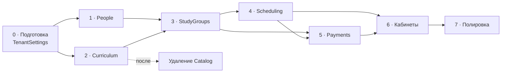

# Этапы внедрения

← [[Бэклог]]

Порядок и риски. Сами задачи — в [[Задачи · Новые модули]],
[[Задачи · Доработки каркаса]], [[Задачи · Frontend]],
[[Задачи · Удаление Catalog]]; здесь они не дублируются.

Порядок продиктован зависимостями модулей ([[Карта модулей]]), а не удобством.

## Критический путь

`People` и `Curriculum` независимы — можно вести параллельно.
`Payments` зависит от `Scheduling` только в части потарифного начисления:
помесячные тарифы делаются раньше.

## Этапы

| Этап                     | Цель                       | Задачи                                                  | Риски                                                          |
| ------------------------ | -------------------------- | ------------------------------------------------------- | -------------------------------------------------------------- |
| **0 · Подготовка**       | база под предметные модули | [[Задачи · Доработки каркаса]] → Multitenancy, Identity | `TimeZoneId` блокирует этап 4; `AppTenantInfo` трогать нельзя  |
| **1 · People**           | в системе есть люди        | [[Задачи · Новые модули]] → People                      | `IPeopleScopeResolver` должен покрыть сценарии этапов 3–5      |
| **2 · Curriculum**       | программа описана          | → Curriculum                                            | паттерны копируются из Catalog **до** его удаления             |
| **— · Удаление Catalog** | демо-модуль убран          | [[Задачи · Удаление Catalog]]                           | только после того, как Curriculum покрыт тестами; отдельным PR |
| **3 · StudyGroups**      | ученики распределены       | → StudyGroups                                           | зачисление — историческая запись, не текущее состояние         |
| **4 · Scheduling**       | расписание живёт           | → Scheduling                                            | **самый долгий**: часовые пояса, повторяемость, конфликты      |
| **5 · Payments**         | деньги учтены              | → Payments                                              | арифметика сумм, идемпотентность обработчиков                  |
| **6 · Кабинеты**         | ученики заходят сами       | Frontend + Notifications, Chat, Tickets, Identity       | перегрузить уведомлениями легко                                |
| **7 · Полировка**        | продукт готов              | Webhooks, Auditing, Billing, терминология, демо-данные  | —                                                              |

## Где сосредоточен риск

### Этап 0 — обманчиво мелкий

Часовой пояс выглядит как одно поле. Если его не завести сейчас, на этапе 4
генератор расписания будет написан на UTC-арифметике и сломается на первом же
переходе на летнее время — переписывать придётся работающий код вместе
с миграцией уже созданных занятий.

Плюс ловушка: очевидное место для поля — `AppTenantInfo` — лежит в защищённом
`src/BuildingBlocks`. Правильный путь — сущность `TenantSettings` внутри модуля
[[Multitenancy]], по образцу `TenantTheme`. Подробно — [[Задачи · Доработки каркаса]].

### Этап 4 — три источника трудноуловимых багов

Часовые пояса, повторяемость, конфликты ресурсов. Заложить время на отладку
генератора; тесты на переход на летнее время писать **до** реализации, а не после.
Библиотеку календаря выбрать до старта ([[Открытые вопросы]]).

### Этап 5 — цена ошибки максимальна

Неверная арифметика в счетах обнаружится не тестами, а конфликтом с родителем.
Покрытие: суммы строк, частичные оплаты, сторно, переплата, пропорциональные
начисления, округление.

Плюс идемпотентность: доставка событий «минимум один раз», повторный
`SessionHeld` не должен начислить дважды.

### Удаление Catalog — вопрос момента, а не сложности

Удалить легко. Опасно удалить **рано**: Catalog — единственный полный пример
конвенций проекта в кодовой базе. До готовности Curriculum он ценнее как
справочник, чем как удалённая папка.

## Определение готовности этапа

Полный чек-лист — в [[Бэклог]]. Кратко: сборка без предупреждений,
`Architecture.Tests` зелёные, тест изоляции тенантов на каждую сущность,
Playwright на сценарии этапа, правила для ИИ-инструментов, обновлённый справочник
модуля, публичная документация и changelog.

## Связанное

[[Бэклог]] · [[Задачи · Новые модули]] · [[Задачи · Доработки каркаса]] · [[Задачи · Frontend]] · [[Открытые вопросы]]
