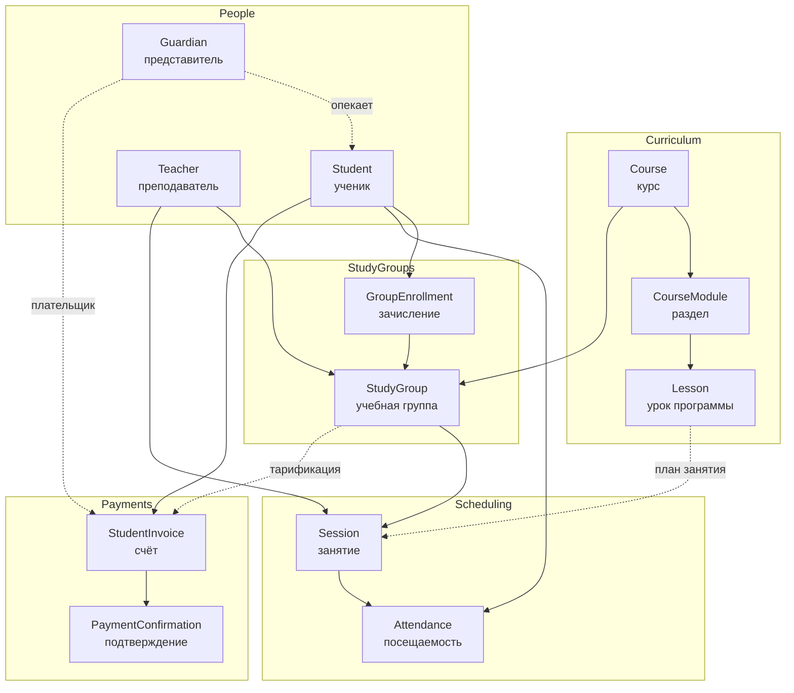

# Edvantix — менеджмент онлайн-школ

> [!info] Что это за хранилище
> Внутренняя проектная документация (Obsidian vault) для системы **Edvantix**.
> Здесь живут проектные решения, доменная модель, план миграции стартер-кита,
> договорённости команды и бэклог. Публичного docs-сайта в отдельном репозитории нет —
> вся документация проекта хранится здесь, рядом с кодом.
>
> Технические конвенции кода остаются в [`AGENTS.md`](../AGENTS.md) и `.agents/rules/` —
> дублировать их здесь не нужно, только ссылаться.

## Что строим

Edvantix — SaaS-платформа управления онлайн-школами. Одна школа = один тенант
(см. [[ADR-001 Школа как тенант]]). Внутри школы: программа обучения, учебные группы,
расписание занятий, посещаемость, счета ученикам, преподаватели, менеджеры, коммуникации.

Основа — форк fullstackhero .NET Starter Kit: модульный монолит .NET 10 + два React 19
приложения. Каркас (Identity, Multitenancy, Auditing, Files, Webhooks, Chat, Tickets,
Notifications, Billing) переиспользуется почти целиком; предметная часть пишется с нуля.

---

## Навигация

### Обзор
- [[Продуктовое видение]] — зачем, для кого, границы MVP
- [[Глоссарий]] — единый язык (**читать до написания кода**)
- [[Роли и сценарии]] — кто что делает в системе

### Архитектура
- [[Обзор архитектуры]] — слои, стек, композиция
- [[Карта модулей]] — какие модули есть, какие появятся, порядок загрузки
- [[Мультитенантность]] — изоляция школ
- [[Модель прав доступа]] — гибкая ролевая система, каталог прав
- [[Интеграционные события]] — связи между модулями
- [[Регистрация модуля]] — чек-лист «четырёх мест»

### Модули — справочник

Что модуль представляет собой, его домен и контракты. Без планов работ:
они в разделе «Задачи».

**Новые (предметная область школы)**
- [[People]] — ученики, преподаватели, представители
- [[Curriculum]] — курсы, разделы, уроки, материалы
- [[StudyGroups]] — учебные группы и зачисления
- [[Scheduling]] — расписание, занятия, посещаемость
- [[Payments]] — тарифы, счета ученикам, подтверждение оплат

**Существующие (каркас)**
- [[Identity]] · [[Multitenancy]] · [[Billing]] · [[Auditing]] · [[Files]]
- [[Webhooks]] · [[Chat]] · [[Tickets]] · [[Notifications]]

**Удаляется**
- [[Catalog (удаляется)]] — демо-витрина e-commerce

### Frontend
- [[Admin (операторская)]] — управление платформой, SuperAdmin
- [[Dashboard (школа)]] — рабочее место школы
- [[Карта экранов]] — инвентарь экранов обоих приложений

### Задачи
- [[Бэклог]] — конвенция и живой индекс задач (`EDX-NNN`, один файл — одна задача)
- [[Открытые вопросы]] — продуктовые развилки, которые ещё не решены
- [[Этапы внедрения]] — порядок работ и ретроспектива по рискам (этапы 0–7)

### Решения (ADR)
- [[ADR-001 Школа как тенант]]
- [[ADR-002 Catalog заменяется на Curriculum]]
- [[ADR-003 People как отдельный модуль]]
- [[ADR-004 Payments отдельно от Billing]]
- [[ADR-005 Именование Group и StudyGroup]]
- [[ADR-006 Урок программы и занятие расписания]]

---

## Карта предметной области

## Статус

| Область | Состояние |
|---|---|
| Каркас (Identity, Multitenancy, Auditing, Files, Webhooks, Chat, Tickets, Notifications, Billing) | ✅ есть в коде |
| Catalog (демо e-commerce) | ✅ удалён (PR #12 backend, #23 frontend) |
| People, Curriculum, StudyGroups, Scheduling, Payments (бэкенд) | ✅ есть в коде |
| Frontend школы (dashboard + admin, этапы 1–7) | ✅ слит в `main` (PR #14–#31) |
| Открытые задачи | см. [[Бэклог]] — доработки карточек People, API-ключи, чат групп, iCal, нумерация счетов и др. |
